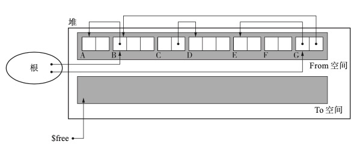
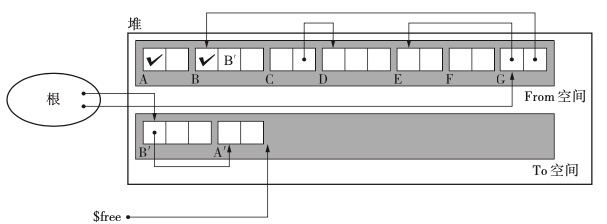
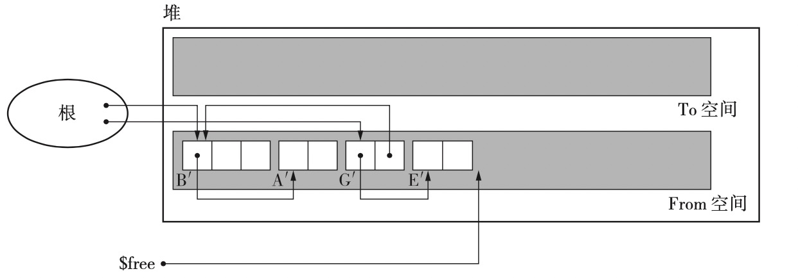

## GC 复制算法

GC 复制算法会将整个堆分成完全相等的两部分，在分配空间时只使用其中的一半，即 From 区域；当无法分配空间时，会将 From 空间中的活动对象复制到 To 区域中；复制完毕后，交换 From 和 To 区域的指针。

伪代码如下：

```c
void copying(){
  $free = $to_start
  for(r : $roots)
    *r = copy(*r)
  swap($from_start,$to_start)
}

void copy(obj){
if(obj.tag != COPIED)
	copy_data($free, obj, obj.size) 
  obj.tag = COPIED
	obj.forwarding = $free
	$free += obj.size
	for(child : children(obj.forwarding)) 
    *child = copy(*child)
return obj.forwarding 
}
```

首先，from_start end_start 都是全局指针，分别指向两个半堆的其实位置；free 也是全局指针，但不同阶段含义不同；

其次，每个对象有两个额外的字段，一个是标记对象是否已经被遍历过的标签 tag，一个是指示对象在 to 区域中的位置；

### GC 复制过程

假设初始状态如下：



初始时， from 堆上有 6 个对象，其中 E 和 F 是垃圾；而 B 和 G 可以通过根直接访问到。

#### 复制 B 对象

首先通过根访问到 B 对象，并将 B 复制到 to 空间中，复制完毕后，整个状态如下：


可以看到，通过 B 复制出 B‘，根从指向 B 转而指向 B’，B 的 tag 被标记，表示已经复制过，而 B 的forward 字段指向 B’；但是复制出来的 B‘，依然指向 from 空间中的 A；要注意的是，此时的 free 指针已经从 to 的开始移动到了 B‘ 对象的下一个位置；

#### 复制 A 对象

在复制完 B 后，开始对 B 能引用的所有对象进行遍历和复制操作，B 只引用了 A，因此将 A 复制到 to 空间中，成为 A’，状态如下：



复制 A 和复制 B 很类似，只是 A 没有引用任何对象，因此复制完 A 后，就直接返回了；


#### 复制 G E

接下来是返回到跟对象上，开始复制 G 对象；G 对象的复制与 B 对象没区别，当复制完 G 后，需要复制 G 引用的对象，即 B 和 E；由于 B 已经被复制过，因此 G 直接将原先指向 B 的指针指向 B’ 即可，然后 E 对象需要新复制一遍。

#### 最终结果

当所有活动对象都复制完毕后，最终状态如下：



可以看到，新空间中放置都是活动对象，而且相关引用关系也都已经被更新过。


### GC 复制算法下创建对象

在复制算法下，如果要申请空间创建对象，就不需要再遍历空闲链表了，在申请空间时，从 free 指向的位置到 from 之间的整段空间都是空闲的，直接从其中进行分配即可，伪代码如下：

```c
void new_obj(size){
  if($free + size > $from_start + HEAP_SIZE/2)
    copying()
  if($free + size > $from_start + HEAP_SIZE/2)
    allocation_fail()
	obj = $free 
	obj.size = size 
  $free += size 
  return obj
}
```

当申请空间时，申请的空间就在 free 开始的地方；如果空间不够，就执行一次回收后再尝试分配，如果这时候还无法满足要求，则说明整个堆的空间空间都不够。


### GC 复制算法的优点

- 吞吐量高，因为它只遍历堆上活动的对象，而且只遍历一次，标记和清除是同步进行的；
- 分配迅速，因为不用遍历，只要第一次能分配到，就是 0(1) 的时间复杂度；
- 不存在内存碎片，因为对象占用的内存都是沿着 from 空间的一端进行分配的，虽然会有垃圾产生，但是 gc 后会再次都堆积在一头；
- 兼容缓存，可以看到执行复制时，有相连关系的对象在堆上会离得比较近；


### GC 复制算法的缺点


