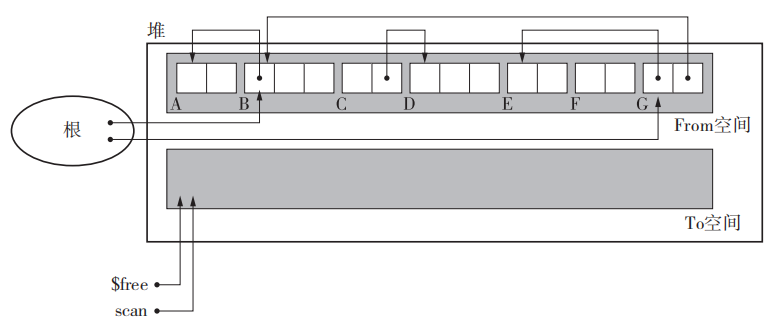
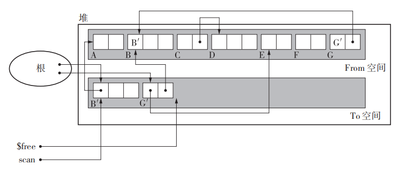
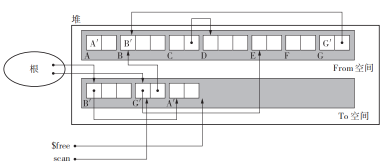
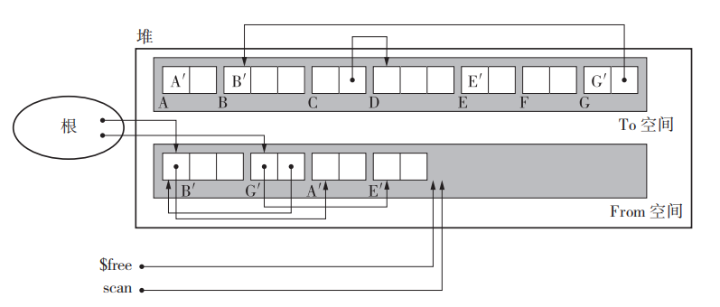
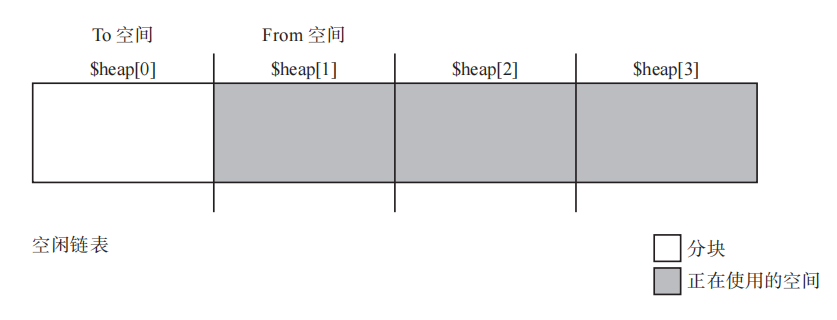
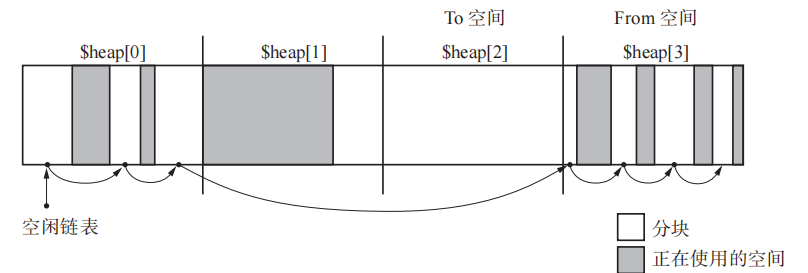

## GC 复制算法

GC 复制算法会将整个堆分成完全相等的两部分，在分配空间时只使用其中的一半，即 From 区域；当无法分配空间时，会将 From 空间中的活动对象复制到 To 区域中；复制完毕后，交换 From 和 To 区域的指针。

伪代码如下：

```c
void copying(){
  $free = $to_start
  for(r : $roots)
    *r = copy(*r)
  swap($from_start,$to_start)
}

void copy(obj){
if(obj.tag != COPIED)
	copy_data($free, obj, obj.size) 
  obj.tag = COPIED
	obj.forwarding = $free
	$free += obj.size
	for(child : children(obj.forwarding)) 
    *child = copy(*child)
return obj.forwarding 
}
```

首先，from_start end_start 都是全局指针，分别指向两个半堆的其实位置；free 也是全局指针，但不同阶段含义不同；

其次，每个对象有两个额外的字段，一个是标记对象是否已经被遍历过的标签 tag，一个是指示对象在 to 区域中的位置；

### GC 复制过程

假设初始状态如下：


初始时， from 堆上有 6 个对象，其中 E 和 F 是垃圾；而 B 和 G 可以通过根直接访问到。

#### 复制 B 对象

首先通过根访问到 B 对象，并将 B 复制到 to 空间中，复制完毕后，整个状态如下：


可以看到，通过 B 复制出 B‘，根从指向 B 转而指向 B’，B 的 tag 被标记，表示已经复制过，而 B 的forward 字段指向 B’；但是复制出来的 B‘，依然指向 from 空间中的 A；要注意的是，此时的 free 指针已经从 to 的开始移动到了 B‘ 对象的下一个位置；

#### 复制 A 对象

在复制完 B 后，开始对 B 能引用的所有对象进行遍历和复制操作，B 只引用了 A，因此将 A 复制到 to 空间中，成为 A’，状态如下：


复制 A 和复制 B 很类似，只是 A 没有引用任何对象，因此复制完 A 后，就直接返回了；


#### 复制 G E

接下来是返回到跟对象上，开始复制 G 对象；G 对象的复制与 B 对象没区别，当复制完 G 后，需要复制 G 引用的对象，即 B 和 E；由于 B 已经被复制过，因此 G 直接将原先指向 B 的指针指向 B’ 即可，然后 E 对象需要新复制一遍。

#### 最终结果

当所有活动对象都复制完毕后，最终状态如下：


可以看到，新空间中放置都是活动对象，而且相关引用关系也都已经被更新过。


### GC 复制算法下创建对象

在复制算法下，如果要申请空间创建对象，就不需要再遍历空闲链表了，在申请空间时，从 free 指向的位置到 from 之间的整段空间都是空闲的，直接从其中进行分配即可，伪代码如下：

```c
void new_obj(size){
  if($free + size > $from_start + HEAP_SIZE/2)
    copying()
  if($free + size > $from_start + HEAP_SIZE/2)
    allocation_fail()
	obj = $free 
	obj.size = size 
  $free += size 
  return obj
}
```

当申请空间时，申请的空间就在 free 开始的地方；如果空间不够，就执行一次回收后再尝试分配，如果这时候还无法满足要求，则说明整个堆的空间空间都不够。


### GC 复制算法的优点

- 吞吐量高，因为它只遍历堆上活动的对象，而且只遍历一次，标记和清除是同步进行的；
- 分配迅速，因为不用遍历，只要第一次能分配到，就是 0(1) 的时间复杂度；
- 不存在内存碎片，因为对象占用的内存都是沿着 from 空间的一端进行分配的，虽然会有垃圾产生，但是 gc 后会再次都堆积在一头；
- 兼容缓存，可以看到执行复制时，有相连关系的对象在堆上会离得比较近；


### GC 复制算法的缺点

- 首先，该算法堆的利用率很低，因为它只能用一半的空间来分配对象；
- 不兼容保守式 GC ，因为它会调整活动对象的位置；
- 递归调用很可怕，保不齐会爆栈；


## Cheney GC 复制算法

这是一个改进型的 GC 复制算法，相比上面的 GC 复制，它使用迭代而不是递归来进行复制 GC。

它的伪代码如下：

```c
void copying(){
 scan = $free = $to_start
 for(r : $roots)
 	*r = copy(*r)
 while(scan != $free)
 	for(child : children(scan))
 		*child = copy(*child)
 	scan += scan.size
 swap($from_start, $to_start)
}

void copy(obj){
 if(is_pointer_to_heap(obj.forwarding, $to_start) == FALSE)
 	copy_data($free, obj, obj.size)
 	obj.forwarding = $free
 	$free += obj.size
 return obj.forwarding
}

```

可以看到，这个算法中没有递归调用，而是用迭代方式完成复制动作；

这里除了使用 free 指针外，还引入了一个叫做 scan 的指针；free 指针依然表示空闲空间的开始 处，而 scan 则指向下一个要处理的对象的开始处；

首先将根对象直接引用的对象复制到新空间中；然后对 scan 指向的对象进行处理，依次将其引用的对象都复制到 to 空间中，直到 scan 追上 free，表示都处理完毕。


### 初始状态

假设初始状态如下：



可以看到， 共有 7 个对象， A B E  G 是活动对象，B G 可以直接被根引用到。

初始时，scan 和 free 都指向 to 空间起始的位置。


### 对根引用的对象进行复制



第一步是先复制 B G 对象，可以看到 B G 被复制到 to 空间后，scan 依然指向 to 开始的地方，而 free 则指向新的空闲位置，即此时 scan 指针落后于 free。


### 处理 B 引用的对象



对 B 引用的对象进行复制，即复制 A；A 被复制后，scan 向前移动到新的 G 的位置，而 free 也向前移动。


### 处理 G 引用的对象

在处理完 A 后，因为 B 没有再引用其它对象，而 A 没有引用任何对象，因此 A 处理完毕，开始处理 G 引用的对象，依次对 G 引用的 E B 进行处理，其中 E 需要复制，而 B 由于已经处理过了，直接更新 G 的相关字段即可，在这一步处理 B 结束后，scan 向 to 的终点移动，而 free 不动；正因为这样，scan 就可以追上 free。


### 最终结果

最终状态如下：



最终，scan 追上了 free，处理结束；交换相关指针即可。


### 算法中美妙的地方

可以看到，这个算法在遍历相关属性时，用的是广度遍历，但一般的广度遍历需要一个单独的队列进行辅助；而这里很巧妙的使用了 scan 和 free 之间的空间作为队列，节省了空间。

### Cheney GC 优点

毫无疑问，它几乎没有爆栈的危险，也不用因为频繁的函数调用而消耗太多性能。

### Cheney GC 缺点

这个算法中有相关关系的对象之间离距离比较远，缓存没有上面的好。


## 多空间复制算法

因为在标准的复制算法中，空间利用率很低，为了提高利用率，这个算法提出，将堆均分为 N 份；其中一份是 from 空间，一份是 to 空间，并在这两份中执行复制算法，剩下的 N-2 份则执行标记-清除算法；伪代码如下：

```c
multi_space_copying(){
 $free = $heap[$to_space_index]
 for(r : $roots)
 	*r = mark_or_copy(*r)
 for(index : 0..(N-1))
 	if(is_copying_index(index) == FALSE)
 		sweep_block(index)
 $to_space_index = $from_space_index
 $from_space_index = ($from_space_index + 1) % N
}

mark_or_copy(obj){
 if(is_pointer_to_from_space(obj) == TRUE)
 	return copy(obj)
 else
 	if(obj.mark == FALSE)
 	obj.mark = TRUE
 	for(child : children(obj))
 		*child = mark_or_copy(*child)
 	return obj
}

copy(obj){
 if(obj.tag != COPIED)
 	 copy_data($free, obj, obj.size)
     obj.tag = COPIED
     obj.forwarding = $free
     $free += obj.size
     for(child : children(obj.forwarding))
         *child = mark_or_copy(*child)
     return obj.forwarding
}
```

需要注意的是，虽然算法中依然所有 from 和 to 空间，但是这两个空间并不是固定的，而是在 N 份空间中滚动，from 和 to 空间连续往右滚动。

当开始 gc 时，先对根引用的对象进行操作；这里调用的是 mark_or_copy 函数。要注意的是这个函数虽然起名 mark，但是内部会先判断当前处理的对象是不是在 from 空间中，不在 from 中的调用标记-清楚算法，而在 from 中的则执行 copy 函数；copy 函数中执行复制算法，先将对象在 to 空间中进行复制，然后对其各应用对象调用 mark_or_copy 依次处理。


### 执行过程

假设堆被分为 4 份。

当前堆和各参数状态如下：



注意，依然有空闲链表，因为有 2 个空间是执行标记-清除的。

第一个空间是 to 空间，第二个空间是 from 空间。

第一次 gc 执行结束后，状态变为：


可以看到，gc 后，原来 1 号空间中的对象都堆积在 0 号空间一边，而 2 号 和 3 号空间则包含内存碎片，通过空闲链表连接；而 2 号空间变成了新的 to 空间，3 号变成新的 from 空间。

第二次 gc 后 ，变为：



### 优点

堆利用率变高，因为只有一个块作为交换空间。

### 缺点

因为引入标记-清除，所以当 free 无法满足时，依然会有耗时的遍历操作。
