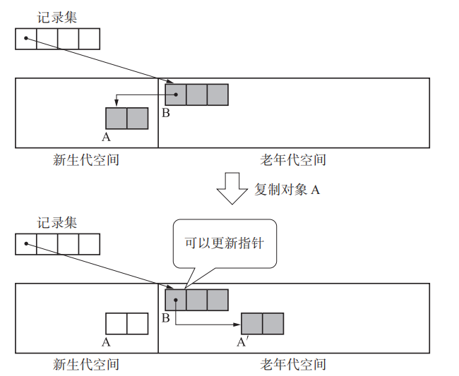
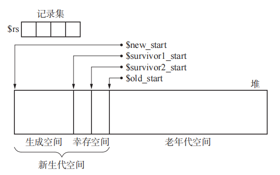
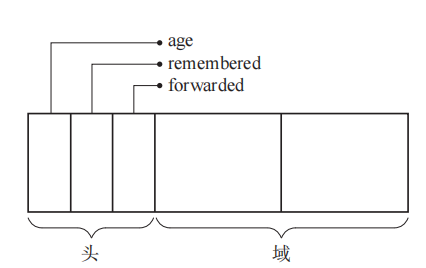

## 分代垃圾回收


分代垃圾回收的核心是，大部分垃圾出生即毁灭，所以查找活动对象时，不需要遍历整个堆，而只需要对那些存活了很久的对象进行判断即可。

没有一个单独的回收算法叫分代垃圾回收，这是一种思想，需要其它算法配合。


### Ungar 分代垃圾回收

这个算法是标记-清除和标记-复制算法的结合，它将整个堆分成四部分，并各自有一个指针指向该区域：

- 新生空间，所有对象都从这个区域开始分配，由 new_start 指针指向这个区域的开头；
- 幸存的 1 号空间，由 survivor1_start 指向开头；
- 幸存的 2 号空间，由 survivor2_start 指向开头；
- 老生代空间，由 old_start 指向；

上面的 4 个空间中，幸存的 1 号 和 2 号空间是用来执行标记-复制算法的，当从新生空间中无法分配到对象时，就会将新生区的对象晋升到幸存空间中。

另外，该算法中还有一个全局的额外指针数组 rs，它记录那些在老生代中哪个对象引用了非老生代的对象。



算法中整个堆的结构如下：





#### 对象结构

这个算法中，每个对象结构如下：



各字段含义如下：

- age，每次  gc 时，这个字段会加1，一旦它达到一定次数，就被认为是老生对象，要移动到老生区；
- rememberd，防止老生代对象被频繁加入记录集；
- forwarded，新生代中用来防止对象被重复复制；

复制算法中，一般都需要用到 forwarding ，这里同样没有单独的这个域，都是用既有的字段来冗余。


#### GC 过程

##### 写入屏障

```c
write_barrier(obj, field, new_obj){
 if(obj >= $old_start && new_obj < $old_start && obj.remembered == FALSE)
 	$rs[$rs_index] = obj
 	$rs_index++
 	obj.remembered = TRUE
 *field = new_obj
}
```

写入屏障是指，当更新一个老生代对象的某个引用时，如果该引用在新生代中，则要将该老生代对象添加到记录集中。

##### 分配对象

该算法中分配对象函数如下：

```c
new_obj(size){
 if($new_free + size >= $survivor1_start)
 	minor_gc()
 if($new_free + size >= $survivor1_start)
 	allocation_fail()
 obj = $new_free
 $new_free += size
 obj.age = 0
 obj.forwarded = FALSE
 obj.remembered = FALSE
 obj.size = size
 return obj
}
```

所有对象都是起于新生代空间，因此会先判断新生代空间够不够，如果不够，需要先对新生代区执行一次 gc，将该区的所有对象移动到幸存空间；然后再去查看整个新生代区是否能满足分配要求，如果不能，那就真不能了，毕竟整个区域给你都不够。

##### minor_gc

上面 new_obj 中，调用的 minor_gc 就是为了对新生代进行 gc，代码如下：

```c
minor_gc(){
 $to_survivor_free = $to_survivor_start
 for(r : $roots)
 	if(*r < $old_start)
 		*r = copy(*r)
 i = 0
 while(i < $rs_index)
 	has_new_obj = FALSE
 	for(child : children($rs[i]))
        if(*child < $old_start)
            *child = copy(*child)
            if(*child < $old_start)
                has_new_obj = TRUE
 	if(has_new_obj == FALSE)
 		$rs[i].remembered = FALSE
 		$rs_index--
 		swap($rs[i], $rs[$rs_index])
 	else
 		i++
 swap($from_survivor_start, $to_survivor_start)
}
```

这段先从根对象算起，先将根直接访问的对象进行复制；

然后从记录集中开始遍历，查看每个老生代对象，对它引用的对象进行复制和判断，如果复制后引用的对象进入了老生代，就从记录集中将其移走；否则要继续在记录集中维持记录。


##### copy 函数

上面在遍历必要的老生代对象时，会复制对象信息，调用的是 copy 函数，该函数伪代码如下：

```c
copy(obj){
 if(obj.forwarded == FALSE)
 	if(obj.age < AGE_MAX)
 		copy_data($to_survivor_free, obj, obj.size)
 		obj.forwarded = TRUE
 		obj.forwarding = $to_survivor_free
 		$to_survivor_free.age++
 		$to_survivor_free += obj.size
 		for(child : children(obj))
 			*child = copy(*child)
 	else
 		promote(obj)
 return obj.forwarding
}
```

它首先判断对象是不是已经足够资深了，如果不资深，就将其移动到 to 空间中，并递归对其引用的各子对象进行处理；否则就调用 promote 函数将其移动到老生代空间中。


##### promote 函数

函数伪代码如下：

```
promote(obj){
 new_obj = allocate_in_old(obj)
 if(new_obj == NULL)
 	major_gc()
 new_obj = allocate_in_old(obj)
 if(new_obj == NULL)
 	allocation_fail()
 obj.forwarding = new_obj
 obj.forwarded = TRUE
 for(child : children(new_obj))
 	if(*child < $old_start)
 		$rs[$rs_index] = new_obj
 		$rs_index++
 		new_obj.remembered = TRUE
 return
}
```


#### 优点

因为它遍历的是少数对象，因此吞吐量会比较高。老生代虽然对象会多一些，但执行频率比较低。

#### 缺点

大部分对象出生即死亡，只是一个经验性法则，对有的程序是不适合的，在这类程序中，很容易造成大量老生代对象，从而引起频繁的 min gc 和 major gc。

