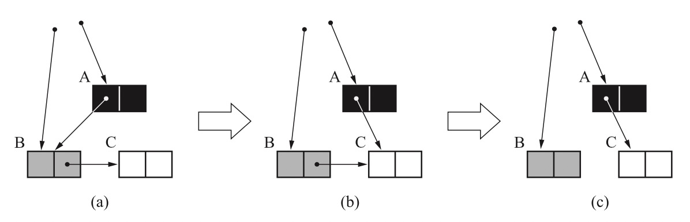
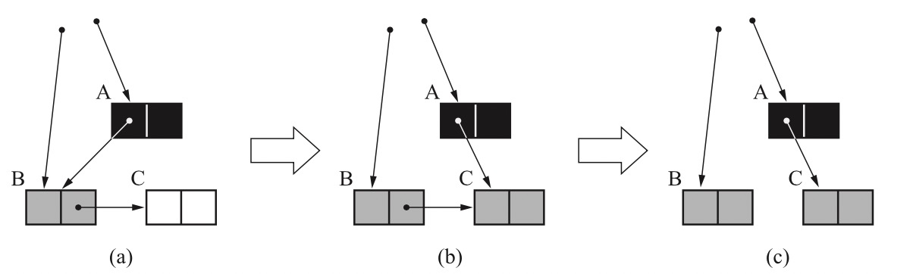

## 增量式 GC

大部分 GC 操作，都是在分配对象空间不足时，执行一次完全的 GC ，这是一个比较繁重的操作，会有明显的暂停。

增量式 GC 是指，GC 不是一次性的，而是分多次运行。


### 三色标记法

三色标记法是增量式 GC 的一种。

所谓三色，是指堆上的对象被会上色，各使用其中的一种：

- 白色，表示对象还未搜索过，以及在清理 时，表示是个垃圾；
- 灰色，表示对象正在被搜索；
- 黑色，表示对象已经搜索完成，而且是活动对象；

这个算法中，开始时，所有对象都是白色，任何可以被访问到的对象都会先被标记位灰色，然后推到栈里边。

遍历过程中，会依次从栈中取出灰色对象，其子对象也会涂成灰色；一个对象的所有子对象都被涂成灰色时，表示该对象完成遍历，改成黑色。

三色标记法也分为三个阶段 ：

- 根查找阶段；
- 标记阶段；
- 清除阶段；

但是与常规的标记-清除算法还是有一定区别；它的伪代码如下：

```c
incremental_gc(){
 case $gc_phase
 when GC_ROOT_SCAN
 	root_scan_phase()
 when GC_MARK
 	incremental_mark_phase()
 else
 	incremental_sweep_phase()
}
```

可以看到，有一个全局性的变量 gc_phase, 用来标记 gc 进行到了哪一步。


#### 根查找阶段

根查找阶段，会从根开始，找到所有可以直接访问到的对象，伪代码如下：

```c
root_scan_phase(){
 for(r : $roots)
 	mark(*r)
 $gc_phase = GC_MARK
}
```

其中调用的 mark 函数如下：

```c
mark(obj){
 if(obj.mark == FALSE)
 	obj.mark = TRUE
 	push(obj, $mark_stack)
}
```

从根遍历的阶段结束后，gc 进入标记阶段。


#### 标记阶段

标记阶段伪代码如下：

```
 incremental_mark_phase(){
     for(i : 1..MARK_MAX)
        if(is_empty($mark_stack) == FALSE)
            obj = pop($mark_stack)
            for(child : children(obj))
                mark(*child)
        else
            for(r : $roots)
                mark(*r)
            while(is_empty($mark_stack) == FALSE)
                obj = pop($mark_stack)
                for(child : children(obj))
                    mark(*child)
            $gc_phase = GC_SWEEP
            $sweeping = $heap_start
            return
}
```

可以看到，它只会执行一定次数的标记过程。但是一旦标记栈变为空，它似乎进行的是一次完整的标记过程。



上图是一次标记阶段的局部图。

配合代码的逻辑看，是能发现问题的：在 a 中，A 引用 B，而 B 引用 C；其中 A 已经涂成黑色，因为 A 引用的对象 B 已经遍历完毕涂成 灰色；C 还没有遍历；这时候标记阶段暂停。在程序继续运行的阶段，A 由引用 B 改为了引用 C，而 B 和 C 之间的引用取消。此时恢复 GC，从 B 开始继续遍历。由于 A 已经处理完毕，导致 C 不会变色，最终被错误当成垃圾处理掉。

#### 写入屏障

为了解决上面的问题，必须在更改对象引用关系时，引入内存屏障：

```
write_barrier(obj,field,newobj){
  if(newobj.mark == FALSE){
  	newobj.mark = TRUE
    push(newobj,$mark_Stack)
  }
  *field = newobj
}
```


上面的逻辑中，书要是在修改对象引用关系时，如果新引用的对象还没有被遍历过，就要将其加入到 mark_stack 中，并将其置灰，如上面的引用关系，在内存屏障处理后会变为：



可以看到，当 A B C 之间的引用关系更改后，C 被标记为灰色，以防止其丢失。