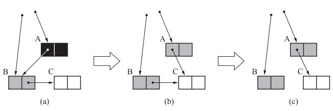
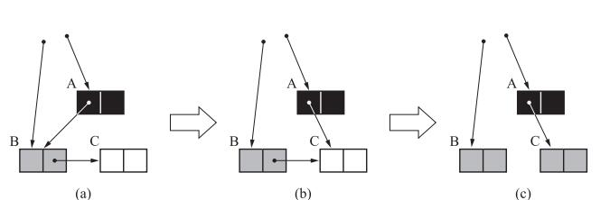

## 增量式 GC

大部分 GC 操作，都是在分配对象空间不足时，执行一次完全的 GC ，这是一个比较繁重的操作，会有明显的暂停。

增量式 GC 是指，GC 不是一次性的，而是分多次运行。


### 三色标记法

三色标记法是增量式 GC 的一种。

所谓三色，是指堆上的对象被会上色，各使用其中的一种：

- 白色，表示对象还未搜索过，以及在清理 时，表示是个垃圾；
- 灰色，表示对象正在被搜索；
- 黑色，表示对象已经搜索完成，而且是活动对象；

这个算法中，开始时，所有对象都是白色，任何可以被访问到的对象都会先被标记位灰色，然后推到栈里边。

遍历过程中，会依次从栈中取出灰色对象，其子对象也会涂成灰色；一个对象的所有子对象都被涂成灰色时，表示该对象完成遍历，改成黑色。

三色标记法也分为三个阶段 ：

- 根查找阶段；
- 标记阶段；
- 清除阶段；

但是与常规的标记-清除算法还是有一定区别；它的伪代码如下：

```c
incremental_gc(){
 case $gc_phase
 when GC_ROOT_SCAN
 	root_scan_phase()
 when GC_MARK
 	incremental_mark_phase()
 else
 	incremental_sweep_phase()
}
```

可以看到，有一个全局性的变量 gc_phase, 用来标记 gc 进行到了哪一步。


#### 根查找阶段

根查找阶段，会从根开始，找到所有可以直接访问到的对象，伪代码如下：

```c
root_scan_phase(){
 for(r : $roots)
 	mark(*r)
 $gc_phase = GC_MARK
}
```

其中调用的 mark 函数如下：

```c
mark(obj){
 if(obj.mark == FALSE)
 	obj.mark = TRUE
 	push(obj, $mark_stack)
}
```

从根遍历的阶段结束后，gc 进入标记阶段。


#### 标记阶段

标记阶段伪代码如下：

```
 incremental_mark_phase(){
     for(i : 1..MARK_MAX)
        if(is_empty($mark_stack) == FALSE)
            obj = pop($mark_stack)
            for(child : children(obj))
                mark(*child)
        else
            for(r : $roots)
                mark(*r)
            while(is_empty($mark_stack) == FALSE)
                obj = pop($mark_stack)
                for(child : children(obj))
                    mark(*child)
            $gc_phase = GC_SWEEP
            $sweeping = $heap_start
            return
}
```

可以看到，它只会执行一定次数的标记过程。但是一旦标记栈变为空，准备进入清除阶段前，它会重新进行一次 mark 操作，主要是因为两次 mark 中间，可能有新的对象生成并可以通过根访问到，如果不增加一次这样处理的话，可能会误杀这些新对象。


上图是一次标记阶段的局部图。

配合代码的逻辑看，是能发现问题的：在 a 中，A 引用 B，而 B 引用 C；其中 A 已经涂成黑色，因为 A 引用的对象 B 已经遍历完毕涂成 灰色；C 还没有遍历；这时候标记阶段暂停。在程序继续运行的阶段，A 由引用 B 改为了引用 C，而 B 和 C 之间的引用取消。此时恢复 GC，从 B 开始继续遍历。由于 A 已经处理完毕，导致 C 不会变色，最终被错误当成垃圾处理掉。

#### 写入屏障

为了解决上面的问题，必须在更改对象引用关系时，引入内存屏障：

这里是 Edsger W. Dijkstra 给出的内存屏障算法：

```
write_barrier(obj,field,newobj){
  if(newobj.mark == FALSE){
  	newobj.mark = TRUE
    push(newobj,$mark_Stack)
  }
  *field = newobj
}
```


上面的逻辑中，书要是在修改对象引用关系时，如果新引用的对象还没有被遍历过，就要将其加入到 mark_stack 中，并将其置灰，如上面的引用关系，在内存屏障处理后会变为：


可以看到，当 A B C 之间的引用关系更改后，C 被标记为灰色，以防止其丢失。

#### 清除阶段

清除阶段和标记-清除算法中差不多，不过需要做一些改造：

```c
incremental_sweep_phase(){ 
  swept_count = 0 
  while(swept_count < SWEEP_MAX)
		if($sweeping < $heap_end) 
      if($sweeping.mark == TRUE)
				$sweeping.mark = FALSE 
      else
				$sweeping.next = $free_list 
        $free_list = $sweeping 
        $free_size += $sweeping.size
			$sweeping += $sweeping.size
			swept_count++ 
     else
			$gc_phase = GC_ROOT_SCAN
			return 
}
```

清除阶段需要注意的是，它每次清除时，指定了最多清除的次数，防止阻塞过长时间；另外就是它由一个全局的 free_size 变量，这个变量在分配对象时有用。


#### 分配对象

分配对象函数如下：

```c
newobj(size){
	if($free_size < HEAP_SIZE * GC_THRESHOLD)
		incremental_gc()
	chunk = pickup_chunk(size, $free_list) 
	if(chunk != NULL)
		chunk.size = size
		$free_size -= size
		if($gc_phase == GC_SWEEP && $sweeping <= chunk)
			chunk.mark = TRUE
		return chunk 
    else
		allocation_fail()
}
```

每次分配新对象时，会先判断当前堆的总空闲空间是不是达到一个临界下限，一旦达到，就执行一次 gc；然后再尝试重新分配，如果还是分配不到，就认为没有满足要求的空间。而新分配的空间也要注意，要防止该空间处于尚未清理的空间，如果是的话，就要将其标记，防止清除阶段被错误当成垃圾处理。


#### 优点

明显，gc 时不会阻塞太久。

#### 缺点

写入屏障会导致吞吐量降低。


### Steele 算法

这个算法是对上面算法的一个改动。上面的算法中，为了保证不会错误将活动对象作为垃圾处理，在修改引用关系时，会将尚未遍历过的新子对象强制性加入 mark_stack 中，也就是说如果这个对象在进程运行过程中变成了垃圾，在下次继续 gc 时，会依然作为活动对象处理，有一段时间的压堆。

这个算法中通过稍微更改上面的逻辑，解决了这个问题。

主要的改动如下：

```c
mark(obj){
 if(obj.mark == FALSE)
 	push(obj, $mark_stack)
}

write_barrier(obj, field, newobj){
 if($gc_phase == GC_MARK && obj.mark == TRUE && newobj.mark == FALSE)
 	obj.mark = FALSE
 	push(obj, $mark_stack)
 *field = newobj
}
```

首先，对一个未遍历对象进行标记时，只将其推入 mark_stack，不管它的颜色。

其次，在写入屏障中，if 的条件会更严格，如果父对象已经被处理过而子对象还没有，则会对父对象进行处理，将其置为灰色，而不是对子对象进行处理。

也就是说如下图：



可以看到，在引用关系更改后，A 被置为灰色，并压入 mark_stack 中；这样 A 会被处理多次，以保证不会错误处理 C。

可以看到，虽然它不会将成为垃圾的 C 压堆，但是因为同一个对象多次被处理，依然有延长 GC 的可能性。


### 汤浅的算法

汤浅的算法是这样的，它只关心记录开始时的那些活动对象，即对 gc 开始时的对象做一次快照；而对于那些在标记结束后清除开始前生成的新对象，汤浅认为不需要处理，因为它们在生成对象时已经被处理过了。

这个算法的标记阶段函数如下：

```c
incremental_mark_phase(){
 for(i : 1..MARK_MAX)
 	if(is_empty($mark_stack) == FALSE)
 		obj = pop($mark_stack)
 		for(child : children(obj))
 		mark(*child)
 	else
 		$gc_phase = GC_SWEEP
 		$sweeping = $heap_start
 		return
}
```

可以看到，在标记行将结束时，Dijkstra 算法会从根开始重新来一次标记，保证新生成的对象都变成黑色，而汤浅的算法中，压根不管。

但是他有自己的写入屏障：

```c
write_barrier(obj, field, newobj){
 oldobj = *field
 if(gc_phase == GC_MARK && oldobj.mark == FALSE)
 	oldobj.mark = TRUE
	 push(oldobj, $mark_stack)
 *field = newobj
 }
```

能看到，当更改引用关系时，如果原来的对象还没有被处理，则对其进行标记处理，新对象不会被处理。




可以看到，从 a 到 b 更改时，只处理 B 而不处理 C，即出现了黑色指向白色的情况，汤浅的算法中不管这种情况；但是 从 b 到 c 时，引用关系发生变化，主要是删除了 B 对 C 的引用，则会将 C 置为灰色，并入栈，保证 C 不会丢失。

而分配时也略有区别：

```c
newobj(size){
 if($free_size < HEAP_SIZE * GC_THRESHOLD)
 	incremental_gc()
 chunk = pickup_chunk(size, $free_list)
 if(chunk != NULL)
 	chunk.size = size
 	$free_size -= size
     if($gc_phase == GC_MARK)
        chunk.mark = TRUE
     else if($gc_phase == GC_SWEEP && $sweeping <= chunk)
        chunk.mark = TRUE
     return chunk
 else
 	allocation_fail()
}
```

分配阶段和 Dijkstra 唯一的区别是，新分配的对象，在标记阶段会无条件设置为黑色。

这个算法会导致大量垃圾堆在堆上。
