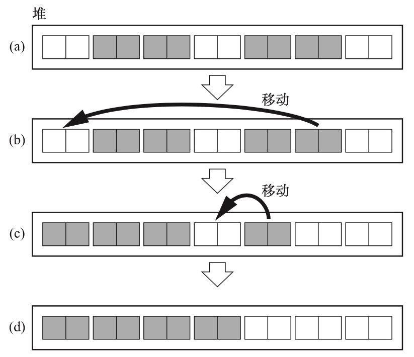
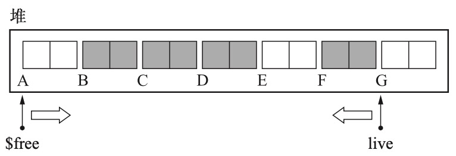
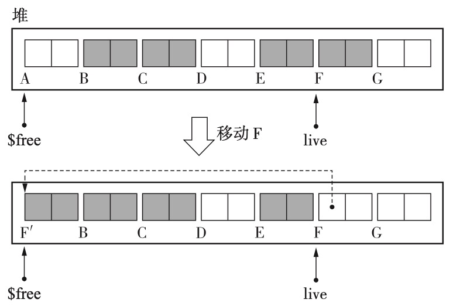

## 标记-压缩算法

这个算法分为将整个 gc 分为两个阶段：

- 对堆上的元素进行遍历标记，找出活动对象；
- 对堆上的活动对象按序迁移到堆的一端；

这个算法有一些具体的不同实现方案。


### Lisp2 标记-压缩算法

在这个算法中，每个对象都有一个域叫 forwarding，它们的作用是标记一个活动对像在被迁移后的新的位置。


#### 算法过程

假设当前堆的状态如下：


通过根可以直接引用到 B 和 D 对象，C 和 F 可以被间接引用到，而 A 和 E 是垃圾。

在执行标记后，对所有活动对象进行标记，状态如下：


可以看到，B C D F 已经被识别出来并打了 tag。

在执行压缩阶段后，状态如下：


对象都被移动到了堆的一侧，而且保持了在堆上原来的顺序。


##### 标记阶段

标记阶段和一般的标记算法没区别，都是从根开始，递归遍历遇到的所有活动对象，并打标签。


##### 压缩阶段

整个压缩阶段伪代码如下：

```c
compaction_phase(){
  set_forwarding_ptr()
  adjust_ptr()
  move_obj()
}
```

过程分为三部分：

- 设置各活动对象的 forwarding 指针；
- 调整指针；
- 移动对象；

###### 设定forwarding指针

首先是设定 forwarding 指针，

```c
set_forwarding_ptr(){
scan = new_address = $heap_start 
while(scan < $heap_end)
	if(scan.mark == TRUE)
		scan.forwarding = new_address
	new_address += scan.size scan += scan.size
}
```

这个阶段只负责更改各对象的 forwarding 指针，不对对象做其他操作。


执行完毕后，可以看到各活动对象新的位置已经都安排好了。

###### 更新指针

这个阶段，会遍历所有活动对象，更新各活动对象对其它对象引用的地址，伪代码如下：

```c
adjust_ptr(){ 
for(r : $roots)
	*r = (*r).forwarding
scan = $heap_start 
while(scan < $heap_end) 
  if(scan.mark == TRUE)
    for(child : children(scan)) 
      *child = (*child).forwarding
	scan += scan.size 
}
```

执行完毕后，状态如下：


可以看到，各对象对其它对象的引用已经都更新到了将来该对象要去的位置。

###### 移动对象

最后一步则是移动对象，伪代码如下：

```c
move_obj(){
scan = $free = $heap_start 
while(scan < $heap_end) 
	if(scan.mark == TRUE)
		new_address = scan.forwarding
		copy_data(new_address, scan, scan.size)
		new_address.forwarding = NULL
		new_address.mark = FALSE
	$free += new_address.size
	scan += scan.size
}
```


这一步没啥好说的，就是移动对象，即所谓的压缩。由于相关指针已经被更新过了，因此不用担心数据被覆盖的问题。

#### 

#### 优点

一方面，压缩有利于缓存；另一方面，可以利用整个堆，堆利用效率高。

#### 缺点

它对堆遍历的次数太多了，光在压缩阶段，就遍历了 3 次，再加上标记阶段的 1 次，遍历 4 次，而且是所有对象都要遍历，吞吐量是很低的。


### Two-Finger 算法

这个算法也是标记-压缩算法的一种，但是该算法有个前提要求，就是所有对象必须一样大；但是这个算法中，不需要给对象专门留一个 forwarding 域，可以使用既有字段。

它由三个步骤组成：

1. 标记对象；
2. 移动对象；
3. 更新指针；



上面是一次 gc 的过程，可以粗略看到，gc 时所有对象大小都一样，而且移动时，活动对象的顺序是没有保证的。而且移动前，对象虽然被移动了，但其原来所在的位置是不会被处理的。

这个算法中有 $free 和 live 两个指针，分别从堆的两端向中间搜索；free 用于搜索非活动对象，live 用于搜索活动对象：




#### gc 过程

##### 标记阶段

全堆标记，略。

##### 移动对象

该阶段伪代码如下：

```c
move_obj(){
$free = $heap_start
live = $heap_end - OBJ_SIZE 
while(TRUE)
	while($free.mark == TRUE) 
    $free += OBJ_SIZE
	while(live.mark == FALSE) 
    live -= OBJ_SIZE
	if($free < live)
		copy_data($free, live, OBJ_SIZE) 
    live.forwarding = $free 
    live.mark = FALSE
	else 
    break
}
```

这个过程中，free 指针从堆开头开始，一直到找到第一个垃圾对象；然后 live 指针从堆尾开始，一直到找到第一个活动对象；

然后将 live 指向的活动对象指到 free 指向的垃圾空间；由于 live 已经被移动，其原来空间中的字段不再需要，可以用来标记它被移动后存储的位置。



上图中能看到，F 对象占用了 A 对象的空间，而 F 的 forwarding 指向了 A 位置。

##### 更新指针

更新阶段，主要是更新活动对象对其它活动对象的引用关系。

```c
adjust_ptr(){ 
  for(r : $roots)
    if(*r >= $free)
      *r = (*r).forwarding
	scan = $heap_start 
  while(scan < $free) 
    scan.mark = FALSE
		for(child : children(scan)) 
      if(*child >= $free)
				*child = (*child).forwarding 
    scan += OBJ_SIZE
}
```

这个算法中，首先调整根对象的指针，这里边要注意的是，因为 free 指向的区域已经是空闲区域，因此一个对象如果指向这个区域，那一定是被移动过的，其 forwarding 字段就是有效的，要用这个字段的值更新相关指针。

其次，要注意遍历依然是从堆开头开始，一直到 free 指针处结束；而且这各区域内的对象都是活动对象，不需要查看它们的 mark 字段，但是要将其设置为 false，方便下次 gc；然后同样，每个对象对其它对象的引用，一旦指向 free 区域后，就一定是被移动过了，需要调整。

##### 优点

相比 lisp2 算法，这个算法不需要单独的 forwarding 域，而且在压缩阶段，只遍历了两次堆，比 lisp2 少一次，效率高一些。

##### 缺点

可以看到，压缩后的有引用关系的对象之间，距离变远了，不利于缓存的使用；

此外该算法要去对象大小一样，要求过高，不过可以结合其它算法一起搞，如对对象进行分域，相同大小的对象分配在一个域中。