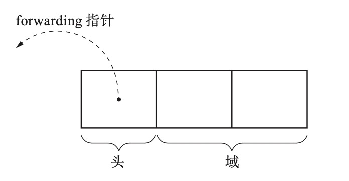
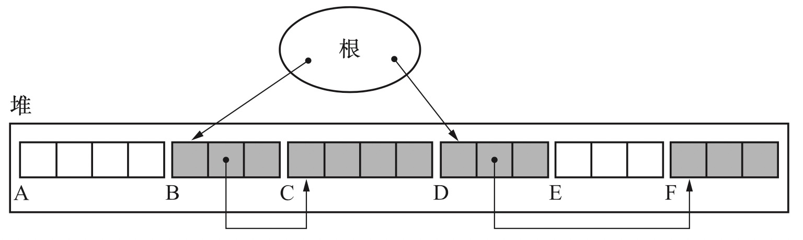
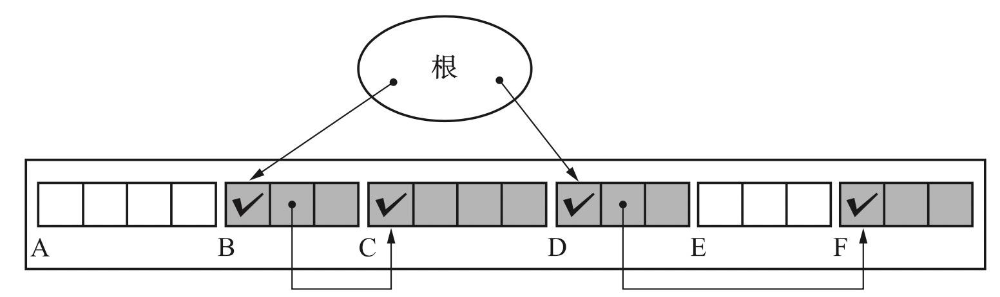
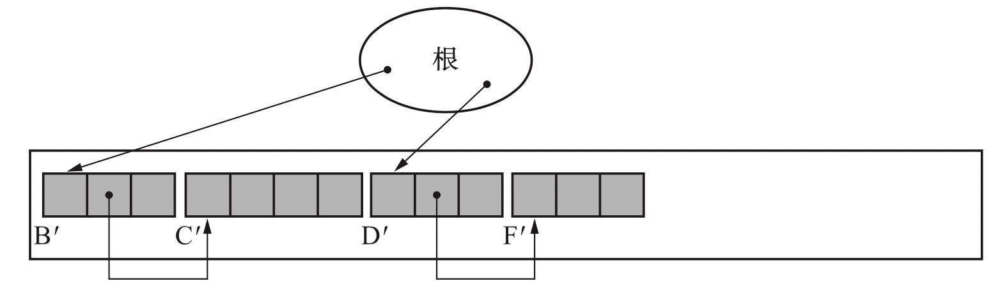
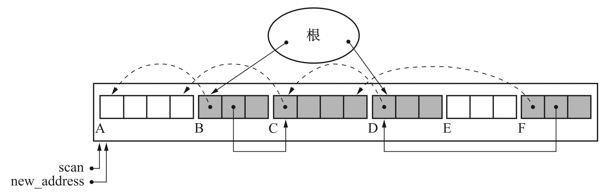
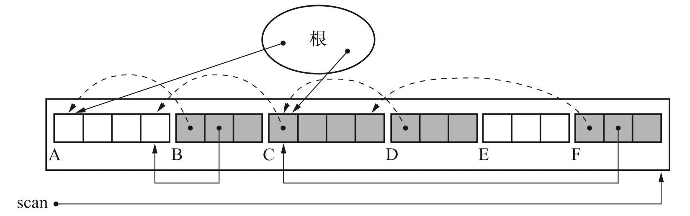
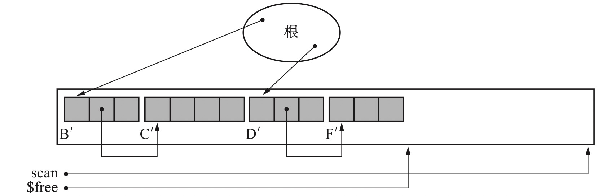

## 标记-压缩算法

这个算法分为将整个 gc 分为两个阶段：

- 对堆上的元素进行遍历标记，找出活动对象；
- 对堆上的活动对象按序迁移到堆的一端；

这个算法有一些具体的不同实现方案。


### Lisp2 标记-压缩算法

在这个算法中，每个对象都有一个域叫 forwarding，它们的作用是标记一个活动对像在被迁移后的新的位置。



#### 算法过程

假设当前堆的状态如下：



通过根可以直接引用到 B 和 D 对象，C 和 F 可以被间接引用到，而 A 和 E 是垃圾。

在执行标记后，对所有活动对象进行标记，状态如下：



可以看到，B C D F 已经被识别出来并打了 tag。

在执行压缩阶段后，状态如下：



对象都被移动到了堆的一侧，而且保持了在堆上原来的顺序。


##### 标记阶段

标记阶段和一般的标记算法没区别，都是从根开始，递归遍历遇到的所有活动对象，并打标签。


##### 压缩阶段

整个压缩阶段伪代码如下：

```c
compaction_phase(){
  set_forwarding_ptr()
  adjust_ptr()
  move_obj()
}
```

过程分为三部分：

- 设置各活动对象的 forwarding 指针；
- 调整指针；
- 移动对象；

###### 设定forwarding指针

首先是设定 forwarding 指针，

```c
set_forwarding_ptr(){
scan = new_address = $heap_start 
while(scan < $heap_end)
	if(scan.mark == TRUE)
		scan.forwarding = new_address
	new_address += scan.size scan += scan.size
}
```

这个阶段只负责更改各对象的 forwarding 指针，不对对象做其他操作。



执行完毕后，可以看到各活动对象新的位置已经都安排好了。

###### 更新指针

这个阶段，会遍历所有活动对象，更新各活动对象对其它对象引用的地址，伪代码如下：

```c
adjust_ptr(){ 
for(r : $roots)
	*r = (*r).forwarding
scan = $heap_start 
while(scan < $heap_end) 
  if(scan.mark == TRUE)
    for(child : children(scan)) 
      *child = (*child).forwarding
	scan += scan.size 
}
```

执行完毕后，状态如下：



可以看到，各对象对其它对象的引用已经都更新到了将来该对象要去的位置。

###### 移动对象

最后一步则是移动对象，伪代码如下：

```c
move_obj(){
scan = $free = $heap_start 
while(scan < $heap_end) 
	if(scan.mark == TRUE)
		new_address = scan.forwarding
		copy_data(new_address, scan, scan.size)
		new_address.forwarding = NULL
		new_address.mark = FALSE
	$free += new_address.size
	scan += scan.size
}
```



这一步没啥好说的，就是移动对象，即所谓的压缩。由于相关指针已经被更新过了，因此不用担心数据被覆盖的问题。

#### 

#### 优点

一方面，压缩有利于缓存；另一方面，可以利用整个堆，堆利用效率高。

#### 缺点

它对堆遍历的次数太多了，光在压缩阶段，就遍历了 3 次，再加上标记阶段的 1 次，遍历 4 次，而且是所有对象都要遍历，吞吐量是很低的。