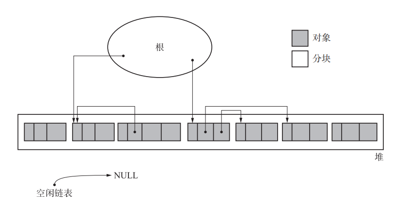
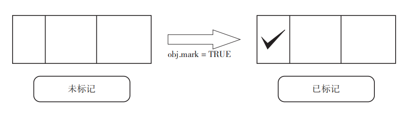
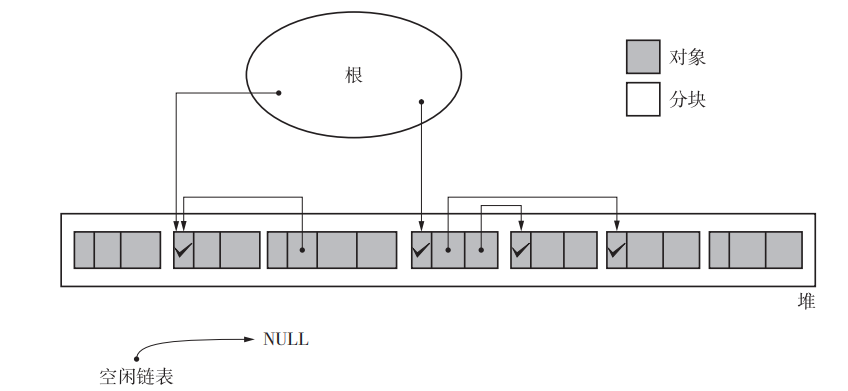
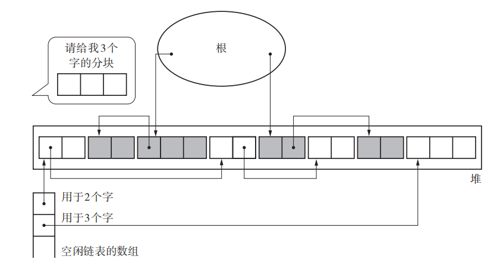
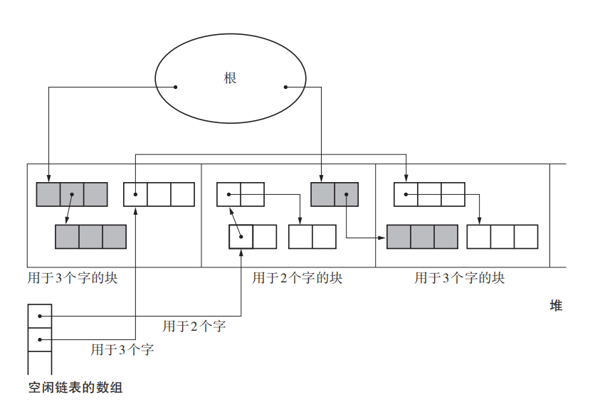
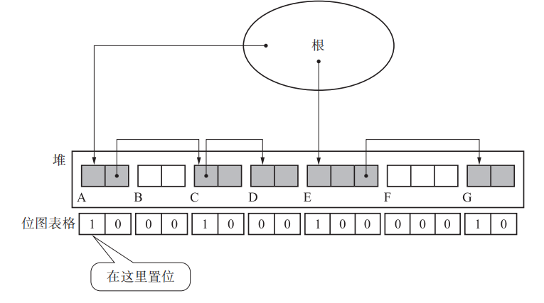

## 标记-清除算法

这个算法基本分为两个阶段：

1. 先对堆上的空间进行标记，找出所有垃圾对象；
2. 将垃圾对象进行回收处理；

伪代码如下：

```c
void mark_sweep(){
 mark_phase();
 sweep_phase();
}
```

假设执行 GC 前堆的状态如下：



这里的根，一般是全局变量或者栈的集合。


### 标记阶段

标记阶段是从根开始，一个个遍历所有可以访问到的对象，并对其打一个标记，表示还可以访问到，伪代码如下：

```c
void mark_phase(){
 for(r : $roots)
 	mark(*r);
}
void mark(obj){
 if(obj.mark == FALSE)
 	obj.mark = TRUE
 	for(child : children(obj))
 		mark(*child)
}
```



可以看到，每个对象中有一个叫 mark 的属性，这个属性有两个作用：

- 在标记阶段，用来区分对象是否已经被访问过，如果已经访问过，就不应该再访问一次，防止死循环；
- 在清除阶段，用来区分对象是否还活着，那些没有被打了有效 tag 的对象就是垃圾；


上面的堆，在经过标记阶段后，状态会变为如下：



所有活动对象已经都被标记出来，然后就可以进入清除阶段了。

注：上面标记阶段中用的是深度优先遍历，深度和广度都可以使用。


### 清除阶段

清除阶段会遍历整个堆，将没有打上标记 的对象回收，伪代码如下：

```c
void sweep_phase(){
 sweeping = $heap_start
 while(sweeping < $heap_end)
 	if(sweeping.mark == TRUE)
 		sweeping.mark = FALSE // 对于活动对象，仅仅是将标记位重置
 	else
 		sweeping.next = $free_list // 垃圾对象，将其追加到空闲链表中
 		$free_list = sweeping
 	sweeping += sweeping.size
}
```

上面的代码中，heap_start 是整个堆开始的地址，而 heap_end 则是整个堆结束的地址；实际环境中，堆大小是可变的，即 heap_end 并不是一个固定值，内存不足时可以扩大堆；这里为了简便，当做堆大小不可变处理。


#### 直接追加到空闲链表的问题

上面在回收对象空间时，会将新确定的垃圾对象直接放置在空闲链表上，这有个问题，就是回收的对象可能会越来越小（因为从堆上申请空间时，很难遇到一块区域到校正好合适，往往是从找到的空间中进行切割），最后出现堆依然有大量空闲内存，但每一块都太小，而无法应对一次大空间的申请，即太多的外部碎片。


#### 内存合并

内存合并是指，在回收对象时，不是简单的直接塞到链表中，而是会判断是否可以与当前空闲链表头结点空间进行合并：

```c
void sweep_phase(){
 sweeping = $heap_start
 while(sweeping < $heap_end)
 	if(sweeping.mark == TRUE)
 		sweeping.mark = FALSE
 	else
 		if(sweeping == $free_list + $free_list.size)
 			$free_list.size += sweeping.size // 可以合并
 		else
 			sweeping.next = $free_list
 			$free_list = sweeping
 	sweeping += sweeping.size
}
```

这里比较关键的是上面可以合并的位置，主要就是如果发现两块内存区域是相连的，就直接合并到一起形成一个更大的空闲空间，不过这里只对新节点和头结点进行合并处理，而不是遍历整个空闲链表上的所有节点。

### 标记-清除算法的优点

#### 实现简单

从该算法的伪代码看，逻辑是比较简单清晰的。

#### 兼容保守式 GC

保守式 GC 是一种对象不能移动的算法，像复制算法和标记-压缩算法这类会移动对象的算法，就无法与保守式 GC 兼容；而标记-清除算法中，对象不移动，因此兼容保守式 GC。

#### 没有循环引用问题

从该算法的伪代码中，可以看到，不存在循环引用无法被清除的问题。


### 标记-清除算法的缺点

#### 容易碎片化

因为该算法大部分情况下，都只是将垃圾对象放在空闲链表上，合并是少数，因此很容易出现大量碎片。

#### 新对象分配慢

因为空闲链表中各节点不是连续的，因此每次分配空间时，需要遍历整个堆，耗时会比较高。

#### 不兼容写时复制技术

因为在标记对象时，直接在对象的属性上进行标记，会导致在共享内存的情况下，大量的页复制，这对 linux 这类使用写时复制技术的 os 很不友好。


### 多空闲链表

标准的标记-清除算法中，只使用了一个空闲链表，因此可能出现大量碎片和分配困难。为了解决这个问题，可以引入多个空闲链表：



在多空闲链表中，内存大小一样的区域会挂在同一个链表上。当回收内存时，会根据该区域大小放置在相应的链表上；

而当分配内存时，可以根据需要的大小直接到对应链表上获取，而不需要再遍历整个堆，分配性能被大大改善；

但是上面有个问题，就是不可能给每种内存规格都设置一个链表，因此当大小到了一定程度后，会不再区分大小，而直接扔到同一个空闲链表上，就像上面的标记-清除算法一样。


### BiBOP 法

这个方法的全程是 Big Bag Of Pages，它的核心思想是指将大小相近的对象整理成固定大小的块进行管理。




### 位图标记

标准的标记-清除算法中，由于标记和清除阶段会在对象的头空间写入内容，导致写时复制。

为了解决这个问题，可以把表示内存区域是否已被标记的属性从该区域挪走，统一放在一个单独区域（即位图区），如下图：



每个字节都有一位表示该区域是否存活，当然这时候会有大量位是无效的。

这样，在标记阶段，就不会影响到源堆，每次获取到一个新对象时，都是在独立的空间中进行读写操作。

这样的改进有两个优点：

- 与写时复制兼容；
- 清除阶段，不需要对活动对象进行处理；堆遍历完毕后，直接将位图区域都置位为0即可，而这个区域会明显比较小；


### 延迟清除法

清除时，清除用的时间与堆大小成正比，堆越大，时间越长。延迟清除法主要是为了减少清除阶段的用时，在标记结束后，不是立马执行清除操作。

伪代码如下：

```c
void new_obj(size){
 chunk = lazy_sweep(size)
 if(chunk != NULL)
 	return chunk
 mark_phase()
 chunk = lazy_sweep(size)
 if(chunk != NULL)
 	return chunk
 allocation_fail()
}

void lazy_sweep(size){
 while($sweeping < $heap_end)
 	if($sweeping.mark == TRUE)
 		$sweeping.mark = FALSE
 	else if($sweeping.size >= size)
 		chunk = $sweeping
 		$sweeping += $sweeping.size
 		return chunk
 	$sweeping += $sweeping.size
 $sweeping = $heap_start
 return NULL
}
```

上层申请空间时，调用 new_obj 进行申请；而 new_obj 内部会直接调用 lazy_sweep 函数，这个函数会从当前 sweeping 指针处开始遍历，只要遇到一个满足分配尺寸的垃圾空间，就直接返回；如果一直遍历到堆结束还没有找到这样的对象，就将 sweeping 重置到堆开头。而在 new_obj 中，第一次调用 lazy_sweep 失败的话，就执行一次 mark 操作，试图将堆上更多的垃圾释放出来；然后再执行一次 lazy_sweep 操作，这次是从堆开头进行遍历，如果依然没有找到合适的，就说明目前堆上确实没有合适的内存区域。

这个算法中，sweeping 是一个全局指针；整个算法把清除垃圾的时间平摊到了多次申请内存空间操作上，以缩短清除操作延时。不过该算法中，标记阶段的延时并没有得到改善。