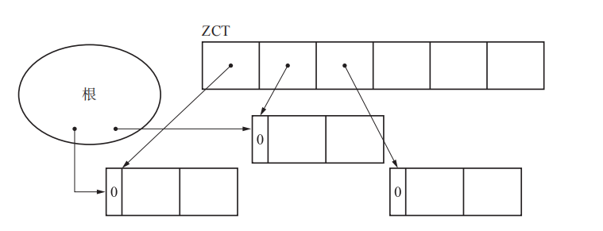
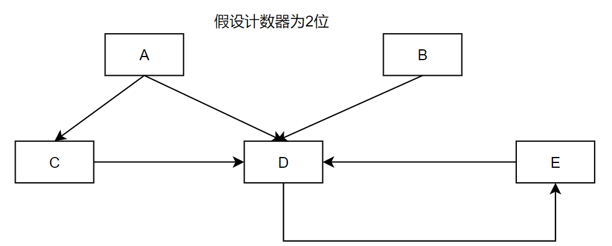
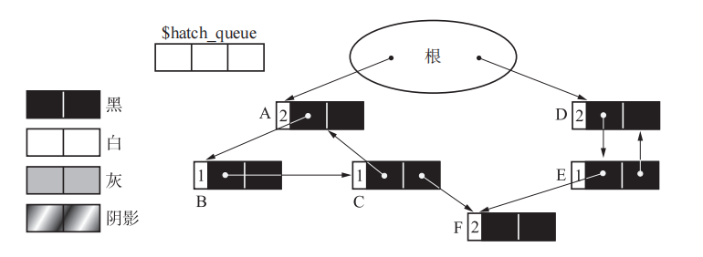
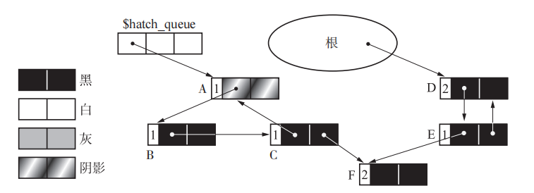
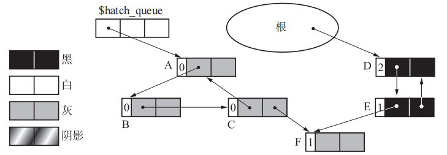
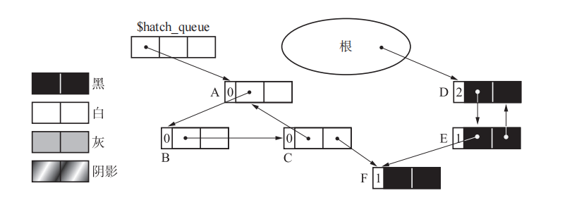

## 引用计数法

### 申请空间

引用计数法中，分配新对象空间的伪代码如下：

```c
void new_obj(size){
 obj = pickup_chunk(size, $free_list)
 if(obj == NULL)
 	allocation_fail()
 else
 	obj.ref_cnt = 1
 	return obj
}
```

引用计数法中，只要分配对象时，返回 null，就说明堆上上没有空间给你用了；而分配成功时，对象的计数器会立马先置位为1.


### 更新引用关系

当更新两个对象间的引用关系时，会涉及到相应对象计数器的修改：

```c
void update_ptr(ptr, obj){
 inc_ref_cnt(obj)
 dec_ref_cnt(*ptr)
 *ptr = obj
}

void inc_ref_cnt(obj){
 obj.ref_cnt++
}

void dec_ref_cnt(obj){
 obj.ref_cnt--
 if(obj.ref_cnt == 0)
 	for(child : children(obj))
 		dec_ref_cnt(*child)
 	reclaim(obj)
}
```

这里看到，当对象 A 指向 对象  B 时，会 增加 B 的引用计数，减少 A 原来引用的对象的计数，而原来的对象，一旦其计数变为 0， 就意味着要被回收了。


### 优点

- 可以立即对垃圾进行回收，不需要专门的时间窗口找出谁是垃圾并回收，垃圾存留时间短；
- 因为可以立马收回垃圾空间，程序暂停时间短；
- 不需要沿着引用指针遍历整个堆；


### 缺点

- 因为每次更改引用时，都要更改计数器，因此对计数器的更新会比较频繁；
- 计数器占位多，对于小对象来说，计数器占位比例尤其高；
- 维护复杂，因为所有引用关系的更新不能直接赋值，必须调用上面的 update_ptr 函数实现，否则会有 bug；
- 循环引用无法回收；


### 延迟引用计数法

延迟引用计数法（Deerred Reference Counting）主要是解决频繁增加计数器的的问题；它的主要思想是，对于从根引用的对象，其引用关系的变化不直接反映在计数器上。

但是这样就会导致计数的错乱，因此需要有手段能维护这个引用关系，为此引入一个 ZCT (Zero Count Table) ，这是一个表，它事先记录所有在 dec_ref_cnt 函数中变为 0 的对象：



可以看到 ，所有引用计数变为 0 的对象，都会在 ZCT 中进行追踪，因为计数为 0 不一定就真是垃圾。

相应的上面的几个函数就要修改：

```c
void new_obj(size){
 obj = pickup_chunk(size, $free_list)
 if(obj == NULL)
 	scan_zct()
 	obj = pickup_chunk(size, $free_list)
 	if(obj == NULL)
 		allocation_fail()
 obj.ref_cnt = 1
 return obj
}

void dec_ref_cnt(obj){
 obj.ref_cnt--
 if(obj.ref_cnt == 0)
 	if(is_full($zct) == TRUE)
 		scan_zct()
 	push($zct, obj)
}

void scan_zct(){
 for(r : $roots)
 	(*r).ref_cnt++
 for(obj : $zct)
 	if(obj.ref_cnt == 0)
 		remove($zct, obj)
 		delete(obj)
 for(r : $roots)
 	(*r).ref_cnt--
}

void delete(obj){
 for(child : children(obj)
 	(*child).ref_cnt--
 	if((*child).ref_cnt == 0)
 		delete(*child)
 reclaim(obj)
}
```

在延迟引用计数法中，当分配新的对象时，如果第一次无法分配到空间，就调用 scan_zct 函数，这个函数会从根节点开始遍历，所有被根节点直接引用的对象，就表示它还活着 ，然后从 zct 表中，那些计数依然为 0 的对象，就被认为是垃圾，对这些垃圾对象进行处理，删除它们，这是一个递归函数，会对这些对象应用的子对象不停处理下去；处理完毕后，回到 new_obj 函数中再次分配，如果还是失败，则说明堆上没有满足要求的内存。

而在 dec_ref_cnt 函数中，会将技术变为  0 的对象送到 zct 表中，但是如果表满了，则会先进行一次垃圾回收。

要注意的是，这个算法中，只是对根节点直接引用的对象这么处理。

#### 优点

主要是根直接引用的操作中，减轻了频繁更改计数器带来的负担；


#### 缺点

首先是垃圾空间不能立马回收，导致它们会堆在堆上；

其次是 scan_zct 是一个遍历堆的耗时函数，会导致申请对象时长变长；


### Sticky 引用计数法

在引用计数法中，要给一个对象设立一个计算引用次数的字段，而这个字段占用的空间不能太小，在计算机内存很紧张的年代，占用大量内存成本高；但是太小又容易出现溢出额问题。当真发生溢出时，需要采取一些措施补救，有两种做法：

#### 什么都不做

当发生溢出时，不再更改该对象的计数器，就放在那里使用；而如果对象成了垃圾，也不再回收。之所以这么做，是因为大部分对象的生命周期都很短，几乎创建就是销毁，很难发生溢出。


#### 使用标记-清除算法管理

当发生溢出后，采用魔改后的标记-清除算法进行辅助, 伪代码如下：

```c
void mark_sweep_for_counter_overflow(){
 reset_all_ref_cnt()
 mark_phase()
 sweep_phase()
}

void mark_phase(){
 for(r : $roots)
 	push(*r, $mark_stack)
 while(is_empty($mark_stack) == FALSE)
 	obj = pop($mark_stack)
 	obj.ref_cnt++
 	if(obj.ref_cnt == 1)
 		for(child : children(obj))
 			push(*child, $mark_stack)
}

void sweep_phase(){
 sweeping = $heap_top
 while(sweeping < $heap_end)
 	if(sweeping.ref_cnt == 0)
 		reclaim(sweeping)
 	sweeping += sweeping.size
}

```

这个算法逻辑如下：

1. 首先将所有计数器全部置位为0；
2. 在标记阶段，从根开始，将根直接引用的对象全部 push 到一个全局的 mark_stack 栈中；然后对该栈不停的进行 pop，每次取出来的对象，计数都 +1；如果当前获取到的对象计数正好为 1，说明还没有被处理过，那么就将该对象引用的所有子对象都 push 到栈中；不断重复这个过程，直到栈变为空，标记阶段结束；
3. 在清除阶段，从堆开头开始，计数依然为 0 的被认为是垃圾，直接回收；

相比原始的标记-清除算法，魔改后的算法中，它不是将对象置位为活动，而是更改它的计数器；而且活动对象进行了多次搜索。

相比原始的引用计数法，这个算法可以解决循环引用的问题，因为循环应用的所有垃圾对象，在标记阶段后，引用次数依然为 0.

但该算法的缺点也很明显，通过伪代码可以看到，在重置阶段，对整个堆进行了一次遍历；在标记阶段对整个堆遍历了一次；在清除阶段，又对整个堆进行了一次遍历，可以说，三请诸葛亮，时间成本太高了，标准的标记-清除算法也不过才遍历两次。

##### 问题

我自己看这个算法，总觉得它是有问题的，因为一旦某个对象恰好溢出，似乎并不能在标记阶段准确的将其识别出来，如下图：



在上面的关系中，假设计数器只有 2 位，即计数器最多能表示 3；

一旦对上图进行标记，在标记阶段结束后，D 的计数会再次因为溢出而再次变为 0，这种情况在清除阶段是识别不出来的。


### 部分标记-清除算法

因为标准的引用计数法无法识别循环引用的垃圾，因此可以在必要时候引入标记-清楚算法，将垃圾找出来。但是标准的标记-清除算法是对整个堆进行遍历，而循环引用的垃圾又很少，效率很低，因此魔改了标准的标记-清除算法，只对可能是循环引用的垃圾进行标记-清除处理。

在这个算法中，所有对象会被标记为 4 种颜色中的一种：


- 黑色，black，绝对不是垃圾对象，对象初始状态就是黑色；
- 白色，white，绝对是垃圾；
- 灰色，gray，搜索完毕的对象；
- 阴影，hatch，可能是循化垃圾的对象；

所有疑似是循环引用垃圾的对象，会被放入到 一个全局队列 hatch_queue 中。


整个算法的伪代码如下：

在减少引用计数时，如果计数变为 0，则直接释放；否则如果它不是阴影状态，就被认为疑似是循环引用的对象，将其染成阴影色，并加入到 hatch_queue 中。

```c
void dec_ref_cnt(obj){
 obj.ref_cnt--
 if(obj.ref_cnt == 0)
 	delete(obj)
 else if(obj.color != HATCH)
 	obj.color = HATCH
 	enqueue(obj, $hatch_queue)
}
```

分配新对象的逻辑如下：

```c
void new_obj(size){
 obj = pickup_chunk(size)
 if(obj != NULL)
 	obj.color = BLACK
 	obj.ref_cnt = 1
 	return obj
 else if(is_empty($hatch_queue) == FALSE)
 	scan_hatch_queue()
 	return new_obj(size)
 else
 	allocation_fail()
}


```

分配新对象时，如果能分配到空间，只要把对象颜色染成黑色即可；如果分配不到，就要看一下 hatch_queue 是否为空，如果不为空，就执行一次垃圾回收的处理，以尝试获取到空间；否则就认为是没有足够的空间可言。

而 new_obj 调用的 scan_hatch_queue ，它会从队列中不停取出对象，如果该对象不是阴影，就什么也不做，继续取下一个，否则依次调用 paint_gray、scan_gray、collect_white 依次处理该对象。

```c
void scan_hatch_queue(){
 obj = dequeue($hatch_queue)
 if(obj.color == HATCH)
 	paint_gray(obj)
 	scan_gray(obj)
 	collect_white(obj)
 else if(is_empty($hatch_queue) == FALSE)
 	scan_hatch_queue()
}

void paint_gray(obj){
 if(obj.color == (BLACK | HATCH))
 	obj.color = GRAY
 	for(child : children(obj))
 		(*child).ref_cnt--
 		paint_gray(*child)
}

void scan_gray(obj){
 if(obj.color == GRAY)
 	if(obj.ref_cnt > 0)
 		paint_black(obj)
 	else
 		obj.color = WHITE
 		for(child : children(obj))
 			scan_gray(*child)
}

void paint_black(obj){
 obj.color = BLACK
 	for(child : children(obj))
 		(*child).ref_cnt++
 		if((*child).color != BLACK)
 			paint_black(*child)
}

void collect_white(obj){
 if(obj.color == WHITE)
 	obj.color = BLACK
 	for(child : children(obj))
 		collect_white(*child)
 	reclaim(obj)
}
```

这个过程比较复杂。

假设堆的初始状态如下：



这里边，ABC 之间有一个循环引用。

当删除 A 对象后，状态如下：



可以看到，A 对象与根节点之间的引用消除后，A 的计数不为0， 被认为疑似是循环引用对象，就将其加入 hatch_queue，同时将其染色为阴影。

假如这时候申请新对象且申请失败，则要迪奥哟了弄过 scan_hatch_queue 函数，对堆进行处理；它会从 hatch_queue  中获取到对象 A，因为 A 是阴影状态，所以对 A 要进行处理。

先调用  paint_gray 函数，将 A 染成灰色，表示 A 现在进入处理状态，之后再遇到 A 时，可以跳过；对  A 所有引用的对象，先将计数都减 1，然后用 paint_gray 函数递归的对这些对象进行处理，处理完毕后，状态如下，B C 对象也都染成了灰色，而且 A  B C 的计数都变成了 0：




在调用完毕 print_gray 函数后，再调用 scan_gray 函数，搜索灰色对象，将引用计数变为  0 的对象都涂成白色，等待最后的回收；而引用计数不为 0 的对象，则要恢复其原来的引用计数值：



最后调用 collect_white 函数，回收白色对象，并从队列中移走，处理结束。

##### 问题和缺点

从上面的代码中可以看到，执行一次回收成本还是比较高的，每个本认为是疑似循环垃圾的每个对象，都被访问了至少 3 次。

其次，它并不能解决自引用的问题，如下图中 A 自己引用了自己，当对 A 进行遍历处理时，A 的计数最终只会减为 1，导致无法释放，又被标记为黑色。

