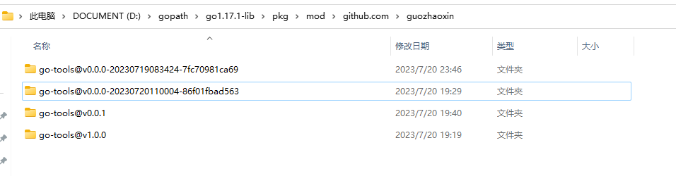

## go-mod 使用


### GO111MODULE

它有三个值：

- off，禁用 mod, 会从 GOPATH  和 vendor 文件夹中找包（<font color=red>相对于什么的文件夹？</font>）；
- on, 启用 mod，忽略 GOPATH  和 vendor，根据 go.mod 下载依赖；
- auto, 默认值，项目在 GOPATH/src 之外，项目根目录有 go.mod 文件时，启用 mod；


### mod 常用命令

| 命令            | 用处                                           |
| --------------- | ---------------------------------------------- |
| go mod download | 下载依赖包到本地（默认为 GOPATH/pkg/mod 目录） |
| go mod edit     | 编辑 go.mod 文件                               |
| go mod graph    | 打印模块依赖图                                 |
| go mod init     | 初始化当前文件夹，创建 go.mod 文件             |
| go mod tidy     | 增加缺少的包，删除无用的包                     |
| go mod vendor   | 将依赖复制到 vendor 目录下                     |
| go mod verify   | 校验依赖                                       |
| go mod why      | 解释为什么需要依赖                             |


### GOLANG 中配置 mod 运行

目前在 golang 中遇到的一些 mod 问题包括：

- 无法下载，这个要保证配置好代理：https://goproxy.cn,direct
- 配置好 mod 值，要注意配置的位置，有时候在 setting 中不生效；


### 用法

第一步是执行 go mod init：

```shell
go mod init xxx
```

设置好当前工程的包名，然后会生成 go.mod 文件。


### go.mod 文件

文件中的  4 个命令：

- module, 指定包名，go mod init 时设置，设置完毕后就不用管了；
- require，指定包的依赖配置模块，所有依赖包就在这里了，所有依赖的依赖也在这里；
- replace，替换依赖项模块，用来替换对应的库<font color=red>(怎么个用法?)</font>；
- exclude，忽略依赖项模块；


#### replace 命令

replace  中的替换，仅在当前包作为 main 包被编译时才生效，如果当前包是作为被其它包引用的一部分编译的，则 replace 不生效；

另外，replace 中指定的包必须是在 require 中声明的包才有效，否则被忽略；


##### 使用场景

###### 1 替换无法下载的包

有的包无法直接下载，需要替换成其它镜像：

```shell
require (
    golang.org/x/text v0.3.2
)

golang.org/x/text v0.3.2 => github.com/golang/text v0.3.2
```

如上面将  golang.org/x/text 替换为 github.com/golang/text，而且这个并不能在 require 中将包直接声明为 github 上的路径就能解决，因为后者只是镜像仓库，其中的 module 依然是前者。


###### 2 调试依赖包

有时候为了方便，可以使用本地包进行调试，通过 replace 将远程包暂时替换为本地包：

```shell
replace (
	github.com/google/uuid v1.1.1 => /uuid
)
```

这里要注意的是，替换后的写法，可能是 /xxx, 也可能是 ../xxx, 至少在我的 win 上，后者是无法生效的；而且后者虽然是本地的，也必须有类似于正常 mod 的工程结构，即必须有 go.mod 文件，且其中声明的包必须和被替换的一样。


###### 3 使用 fork 仓库

这个主要是有时候，有些官方包发现问题，但是官方的修复迟迟没有发布，这时候可以自己 fork 先修复，先用自己的仓库；


###### 4 禁止被依赖

<font color=red>这个不是很懂</font>


###### 5 引入本地包

开发时，需要引入一个本地独立的包 ，或者该包尚未发布时：


```
go 1.13
 
require github.com/article v0.0.0-incompatible		// 引入这个包
 
replace github.com/article => ../article    			// 此处作用：将此包指向本地目录的路径
```


### 如何使用多版本

这是个大问题，因为确实有需求。

我自己封装了一个仓库，github.com/guozhaoxin/go-tools，打算做长期的 go 辅助工具包。

这个仓库中有一个 log 包，用来包装一层日志；然后我打了两个 tag，v1.0.0 和 v0.0.1。

我想在另一个仓库中使用这个包，而且同时使用该包的两个不同 tag 版本和一个指定  commit，则我的 go.mod 文件如下：


```shell
require (
	github.com/guozhaoxin/go-toolsv001 v0.0.1
	github.com/guozhaoxin/go-toolsv100 v1.0.0
	github.com/guozhaoxin/go-tools86f0 v0.0.0-20230720110004-86f01fbad563
)
```

其中，前两个是指定的版本， 第三个是指定的具体 commit id；可以看到，为了同时使用这三个版本，代码中使用的包名变了，要手动指定不重复的路径；此外指定  commit 的那个，还加上了一个不存在 v0.0.0 版本。

但是这三个路径并不存在，因此需要用 replace 替换：

```shell
replace github.com/guozhaoxin/go-toolsv100 => github.com/guozhaoxin/go-tools v1.0.0

replace github.com/guozhaoxin/go-toolsv001 => github.com/guozhaoxin/go-tools v0.0.1

replace github.com/guozhaoxin/go-tools86f0 => github.com/guozhaoxin/go-tools v0.0.0-20230720110004-86f01fbad563
```

上面就是替换的用法，它指明了三个包真实的包信息。

在命令行上安装这三个包：

```shell
go mod download github.com/guozhaoxin/go-tools@86f01fb
go mod download github.com/guozhaoxin/go-tools@v0.0.1
go mod download github.com/guozhaoxin/go-tools@86f01fb@v1.0.0
```

在 GOPATH 下结构如下：



可以看到，同一个包安装了多次，而且通过版本和 commit等信息做了区分；注意的是对 commit 的确实指定了一个不存在的 v0.0.0。

使用的时候如下：

```go
package main

import (
	log86 "github.com/guozhaoxin/go-tools86f0/log"
	log0 "github.com/guozhaoxin/go-toolsv001/log"
	"github.com/guozhaoxin/go-toolsv100/log"
)

func main(){
	log.Init("")
	log.Debugf("what? %s","why")
	log0.Init("")
	log0.Error("?????")
	log86.Init("")
	log86.Debugf("fsafsfsdfsfdfsdsfsfd")
}

```

可以看到，多版本可以同时存在；great！
