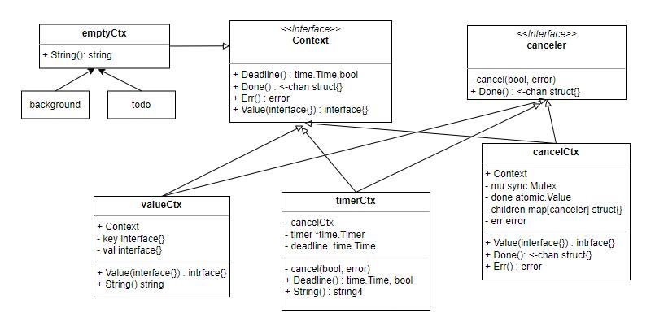

### Context 接口


context 包中，最重要的就是这个接口，这个接口声明了四个函数：

```go
type Context interface {
    Deadline() (deadline time.Time, ok bool)
    Done() <-chan struct{}
    Err() error
    Value(key interface{}interface{}
}
```


这四个函数说明如下：

#### Deadline

Context 可以设置定时时间，时间到了，则 context 取消，并通知给相关的其它 context；

对于设置了时间的 context，这个函数会返回这个时间和 true；如果没有设置，则返回 false；


#### Done

Context 返回一个 channel，如果 context 被取消，则这个 channel 被关闭，这样调用者就可以做一些释放资源或者终止操作的执行；


#### Err

当 Context 终止时，Err 会 返回一个错误，表示终止的原因，因为 context 被终止，可能是用户主动调用了 cancel，也可能是时间到了。


#### Value

Context 可以用来在整个调用链上保存一些相关值，如请求 id、用户 id 等，且这些值是只读的，因为可以看到， Context 没有 set value 的方法。


### emptyCtx 结构体

emptyCtx 实现了 Context 接口，且它是私有的，它只限于 Context 包内部使用。

```go
type emptyCtx int
```

它实现的 4 个函数都很简单，全部是空实现，返回 nil 或者 false。也就是说这个类型的 Context 其实永远都无法取消，也永远不会返回 error。

因为它是私有的，context 包中初始化了两个固定的 emptyCtx 对象：

```go
background = new(emptyCtx)
todo       = new(emptyCtx)

func Background() Context {
	return background
}
func TODO() Context {
	return todo
}
```

这两个对象同样是私有的，context 建议使用这两个对象作为整个 context 调用链的 root ；为了能使用这两个对象，又特意暴露出两个函数分别用来获取这两个实例。

emptyCtx 额外实现了自己的 String 方法，因为 emptyCtx 只有两个固定的实例，因此它的 String 方法返回的信息也是很固定的字符串：

```go
func (e *emptyCtx) String() string { // 所以这个类只许有两个实例
	switch e {
	case background:
		return "context.Background"
	case todo:
		return "context.TODO"
	}
	return "unknown empty Context"
}
```


### canceler 接口

这个接口与 Context 接口没有直接的关系，它声明了两个方法：

```go
type canceler interface {
	cancel(removeFromParent bool, err error)
	Done() <-chan struct{}
}
```

它不会对外使用，但也不会独立使用，而是会配合 Context 实例进行管理。

它有两个具体的实现类，*cancelCtx 和  *timerCtx。


### cancelCtx 结构体

```go
type cancelCtx struct {
	Context
	mu       sync.Mutex            
	done     atomic.Value          // of chan struct{}, created lazily, closed by first cancel call
	children map[canceler]struct{} // set to nil by the first cancel call
	err      error                 // set to non-nil by the first cancel call
}
```

可以看到，它内嵌了一个匿名的 Context ，所以它也是一个 Context。

另一方面，它有一个 children 属性，正是通过这个属性，Context 可以形成一个单向链；


#### cancelCtx 源码

##### Value 方法

```go
func (c *cancelCtx) Value(key interface{}) interface{} {
	if key == &cancelCtxKey {
		return c
	}
	return c.Context.Value(key)
}
```

这个方法有两点要注意：

第一是它会递归查找  key ，如果在自身找不到，就去内部匿名的 Context 中去找；

第二是有一个特殊的 key，cancelCtxKey，这是一个 int 类型的 key，对应的值是 cancelCtx 对象自身；


##### Done 方法

```go
func (c *cancelCtx) Done() <-chan struct{} {
	d := c.done.Load()
	if d != nil {
		return d.(chan struct{})
	}
	c.mu.Lock()
	defer c.mu.Unlock()
	d = c.done.Load()
	if d == nil {
		d = make(chan struct{})
		c.done.Store(d)
	}
	return d.(chan struct{})
}
```

这里也是两个地方有意思：

第一是它使用的是懒汉法去创建 chan，第一次调用 Done 时，这个通道才会创建；

第二是它使用了 go 中的 atomic.Value 存储 channel，以原子的存储和获取通道；


##### Err 方法

```go
func (c *cancelCtx) Err() error {
	c.mu.Lock()
	err := c.err
	c.mu.Unlock()
	return err
}
```

Context 的 Err。


##### cancel 方法

```go
func (c *cancelCtx) cancel(removeFromParent bool, err error) {
	if err == nil {
		panic("context: internal error: missing cancel error")
	}
	c.mu.Lock()
	if c.err != nil {
		c.mu.Unlock()
		return // already canceled
	}
	c.err = err
	d, _ := c.done.Load().(chan struct{})
	if d == nil {
		c.done.Store(closedchan)
	} else {
		close(d)
	}
	for child := range c.children {
		// NOTE: acquiring the child's lock while holding parent's lock.
		child.cancel(false, err)
	}
	c.children = nil
	c.mu.Unlock()

	if removeFromParent {
		removeChild(c.Context, c)
	}
}
```

这个方法是 cancelCtx 对象的私有方法。

当调用该方法时，cancelCtx 会关闭相应的通道，这样监听的协程就可以退出监听；

然后 cancelCtx 会对自己引用的所有子对象，递归调用它们的 cancel 方法，使得这些 cancelCtx 也关闭各自的通道；

最后，cancelCtx 会根据参数配置，将自己从自己的父 Context  中移走；对于cancelCtx 的子 cancelCtx 对象，这个参数会指定为 false，因为 cancel 方法中会调用所有  children 的 cancel 方法，并将 children 置为空，不需要专门移走。


##### WithCancel 函数

```go
func WithCancel(parent Context) (ctx Context, cancel CancelFunc) {
	if parent == nil {
		panic("cannot create context from nil parent")
	}
	c := newCancelCtx(parent)
	propagateCancel(parent, &c)
	return &c, func() { c.cancel(true, Canceled) } 
}
```

这个函数会返回 cancelCtx 对象，它返回的 CancelFunc  函数会执行 cancelCtx 的 cancel  方法，而且会明确设置 cancel 时，从父对象中断开引用。


#### timerCtx 结构体

```go
type timerCtx struct {
	cancelCtx
	timer *time.Timer // Under cancelCtx.mu.
	deadline time.Time
}
```


这个结构体同样实现了 cancel 接口，与 cancelCtx 不同的地方在于，它内部有一个定时器，时间到时，会自动取消自己。

##### cancel 方法

```go
func (c *timerCtx) cancel(removeFromParent bool, err error) {
	c.cancelCtx.cancel(false, err)
	if removeFromParent {
		// Remove this timerCtx from its parent cancelCtx's children.
		removeChild(c.cancelCtx.Context, c)
	}
	c.mu.Lock()
	if c.timer != nil {
		c.timer.Stop()
		c.timer = nil
	}
	c.mu.Unlock()
}
```

需要注意的是，它第一行代码中执行取消时，调用的是自己包含的 cancelCtx 的 cancel 方法，并且传入的是 false。

##### WithTimeout WithDeadline 函数

这两个函数用来返回一个 timeCtx 对象。


#### valueCtx 结构体

```go
type valueCtx struct {
	Context
	key, val interface{}
}
```

同样实现了两个 Context 和 cancel 接口，唯一的不同是，它有一个 key-value 对，但是每个 valueCtx 都只有一对，如果想传入多个，要不停的构建新的 valueCtx 对象。

##### WithValue 方法

这个方法返回一个 valueCtx，就是为了实现上面的功能。
