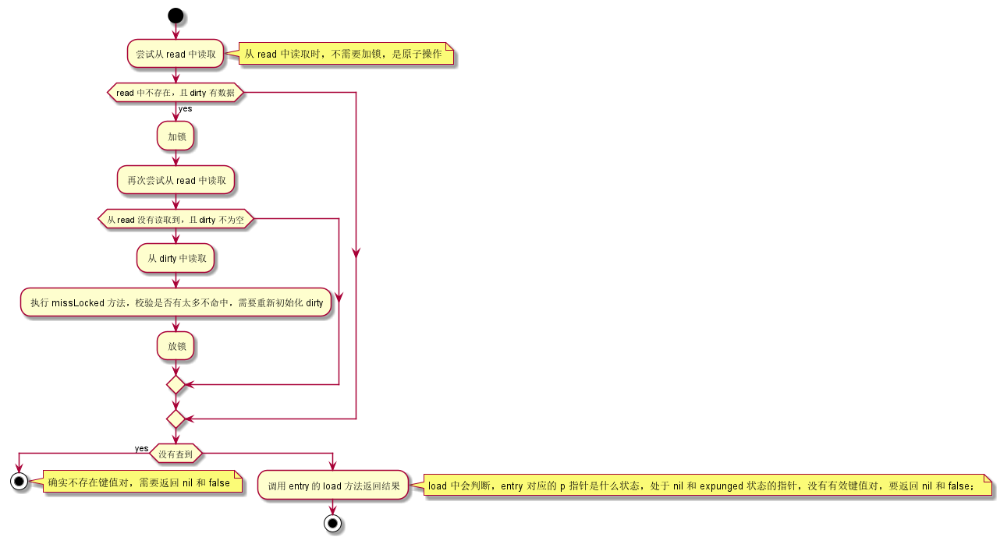
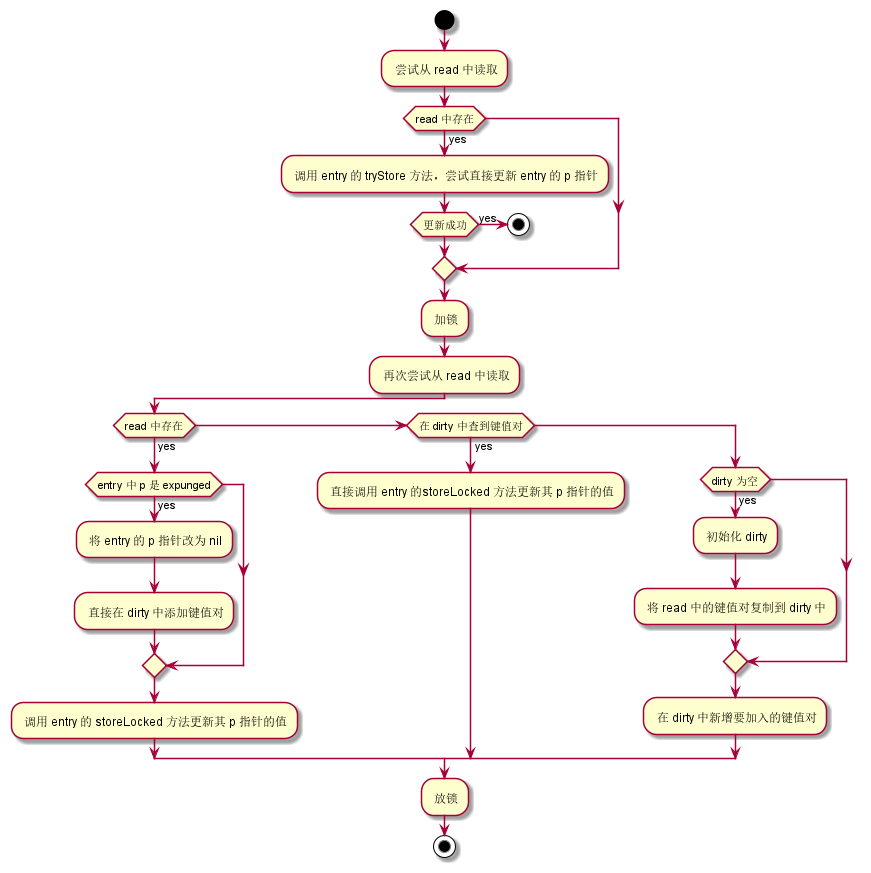

## sync.Map

sync 的 Map 比较有意思的地方，在于它有两个 map，整个结构如下：

```go
type Map struct {
	mu Mutex // 操作 dirty 时使用
	read atomic.Value // 只读类型，并发下安全，本质上是 readOnly 类型
	dirty map[interface{}]*entry
	misses int // 从 read 操作不命中时，会加一，用来更新 read 和 dirty。
}

type readOnly struct {
	m       map[interface{}]*entry
	amended bool 
}

type entry struct {
	p unsafe.Pointer // *interface{}
}
```

在 Map 中，首先操作的是不需要加锁的 read 字段；只有当该属性中无法操作时，才发起加锁动作，然后去 dirty 中操作；而每次需要去 dirty 中操作时，都会让 misses 自增；到了一定阈值，就会将 dirty 中的数据迁移到 read 中，增加命中率。<font color=red>read 似乎是 dirty 的子集。</font>

在 readOnly 中，m 是键值对；而当 readOnly 的数据不完整时，amended 设置为 true，表示如果 read 无法操作，需要加锁去 dirty 中操作。


entry 的 p 有三种值：

1. nil，表示键值对已经删除，m.dirty=nil 或者 m.dirty[key] 指向该 entry；
2. expunged，键值对已经被删除，m.dirty!=nil 且  key 不在 dirty 中；
3. 其它值，表示有效，此时如果 dirty 不是 nil，两者中会保存同样的数据；


### 查询过程

查询用的是 Load 方法，这个方法是这样的：


可以看到，会首先使用不加锁的方式，从 read 中读取；如果 read 中而 dirty 不为空的话，会尝试从 dirty 中读取；但是要注意，当加锁后，依然会先尝试从 read 中读取，有点儿双层单例判断的意思；查询出来的是 entry 对象，这种对象的 p 指针有3中类型的值，所以即使查到 key 有对应的 entry，依然需要对 entry 中的 p 指针判断，如果是无效的，那只能返回 nil。

另外需要注意的是，到 dirty 中查询时，会触发一次 misses 的自增，而 misses 一旦超过某个阈值（阈值不固定，是 dirty 当前的键值对数量），就会将 dirty 清空，其中的 entry 都转移到 read 中；这个操作因为是已经加锁了的，所以不会有同时对 read 写的动作发生。


### 删除过程

删除过程如下：



删除比较有趣的地方在于，如果在 read 中发现映射关系，那么它只会将这个映射关系中 entry 的 p 指针置为空；而如果在 dirty 中发现的话，则会直接删除这个映射关系。


### 更新过程

更新过程如下：



首先会去 read 中读取，如果 read 中存在，则直接就在上面尝试进行更新了；但要注意，由于 entry.p 的三种不同取值含义，当一个键值对在 read 中处于物理删除状态时，是不允许去操作的，此时只能转移到 dirty 中进行，在转移到 dirty 前，会先将其状态改为 nil。所以看下来，就是处于 nil 状态的指针，是可以直接复用的，物理删除的则不行。


### 遍历

遍历使用 Range 方法，这个方法比较坑的地方在于，它在开始遍历前，会将 dirty 中的键值对移动到 read 中，而将 dirty 置为空。但这个操作似乎是 o(1) 的，因为所有 read 中的键值对，在 dirty 中都有。

```go
func (m *Map) Range(f func(key, value interface{}) bool) {
	read, _ := m.read.Load().(readOnly)
	if read.amended {
		m.mu.Lock()
		read, _ = m.read.Load().(readOnly)
		if read.amended {
			read = readOnly{m: m.dirty}
			m.read.Store(read)
			m.dirty = nil
			m.misses = 0
		}
		m.mu.Unlock()
	}

	for k, e := range read.m {
		v, ok := e.load()
		if !ok {
			continue
		}
		if !f(k, v) {
			break
		}
	}
}
```

在从 read 中遍历时，由于有些已经被删除了，所以这里调用 entry 的 load 方法，判断该 entry 是不是已经被删除了。


###  总结

这个 map 比想象中复杂，涉及到很多数据流转。

首先，当需要新增一条记录时，如果这条记录的键正好在 read 中有一个 p 为 nil 的 entry，可以直接无锁去更新这个 p 值，因为 entry 在 read 和 dirty 中是共享的；如果 read 中没有这个条件，则只能去 dirty 中加锁操作，因为 dirty 负责写，而 dirty 操作有很大概率会直接操作它的 map，所以要加锁。另外如果添加操作是直接在 dirty 上执行，则会出现 dirty 数据比 read 有效数据多的情况，所以当 read 查不到时，就要去 dirty 中查询。

数据从 read 到 dirty，如果 dirty 是空，而这时候需要到它上面插入数据，则会将 read 中的数据复制到 dirty 中，但只是复制，不是剪切；

数据从 dirty 到 read，如果超过阈值，会直接用 dirty  替换 read 的键值对，因为 dirty 是全面的数据；或者遍历时也会这样；两种情况下，都会将 dirty 置空；

