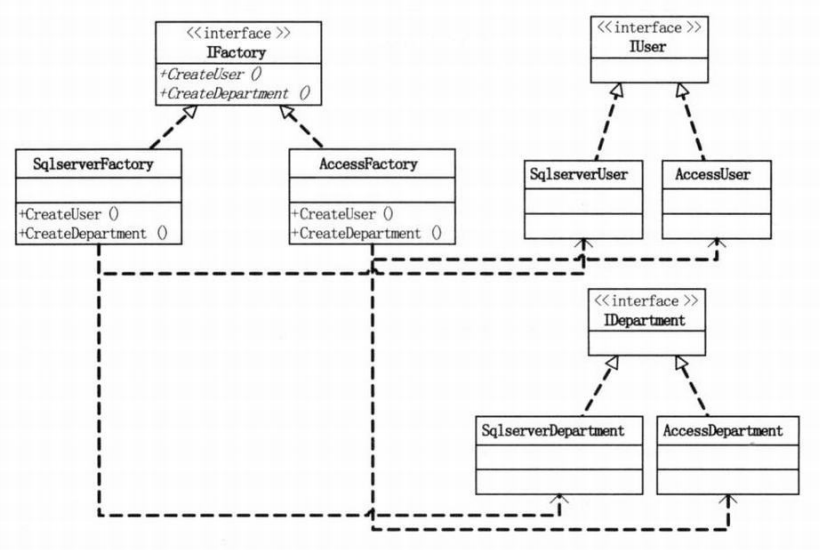
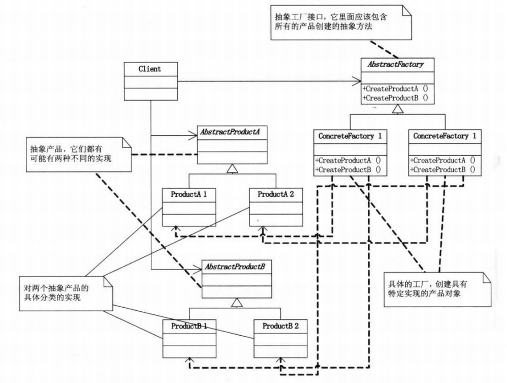

抽象工厂模式，Abstract Factory。

这个模式贼复杂，一般的工厂模式中，根据传入的字符串或者其它标记，返回具体的类实例 。

抽象工厂模式则往往是多个抽象类型的聚合，比如后端常进行的 db 操作。在这个操作中，往往有多个表，而要对接的数据库类型又有多种。这就使得单一工厂模式是不够的，需要使用抽象工厂模式。

以上面的场景为例，假设需要兼容 mysql 和 pg 两个 db，同时有 User 和 Department  两张表，则结构会是这样的：

```java
public interface IFactory{
    public IUser createUser();
    public IDepartment createDepartment();
}

public MysqlFactory class implements IFactory {
    public IUser createUser(){
        return new MysqlUser();
    }
    public IDepartment createDepartment(){
        return new MysqlDemartment();
    }
}

public PgFactory class implements IFactory {
    public IUser createUser(){
        return new PgUser();
    }
    public IDepartment createDepartment(){
        return new PgDemartment();
    }
}

public interface IUser{
    public void insert(User user);
}

public class MysqlUser implements IUser{
    public void insert(User user){
        
    }
}

public class PgUser implements IUser{
    public void insert(User user){
        
    }
}

public interface IDepartment{
    public void insert(Department department);
}

public class MysqlDepartment implements IDepartment{
    public void insert(Department department){
        
    }
}

public class PgDepartment implements IDepartment{
    public void insert(Department department){
        
    }
}
```

以上代码在使用时，是这样的：

```java
public class Client{
	public static void main(){
        User u = new User();
        Department d = new Department();
        
        IFactory factory = new MysqlFactory();
        IUser iu = factory.createUser();
        iu.insert(u);
        IDepartment id = factory.createDepartment();
        id.insert(id);
    }
}
```





完整的抽象工厂模式如下：


